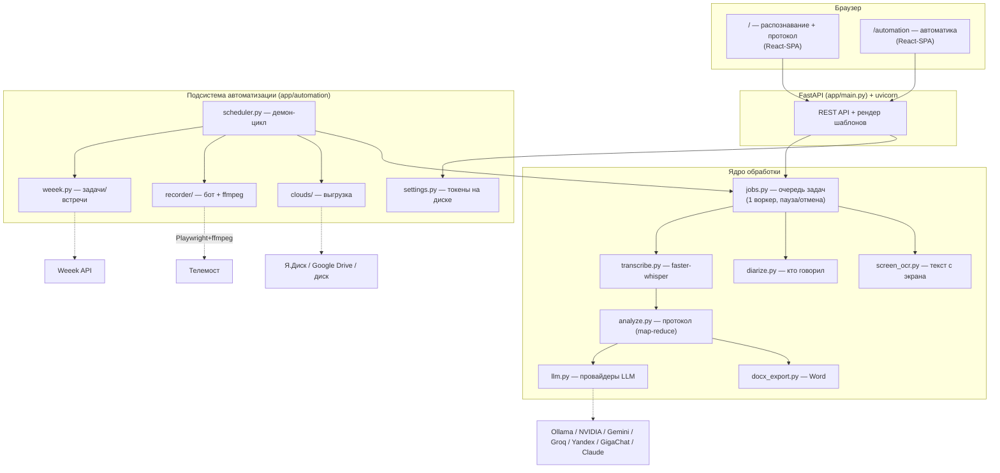
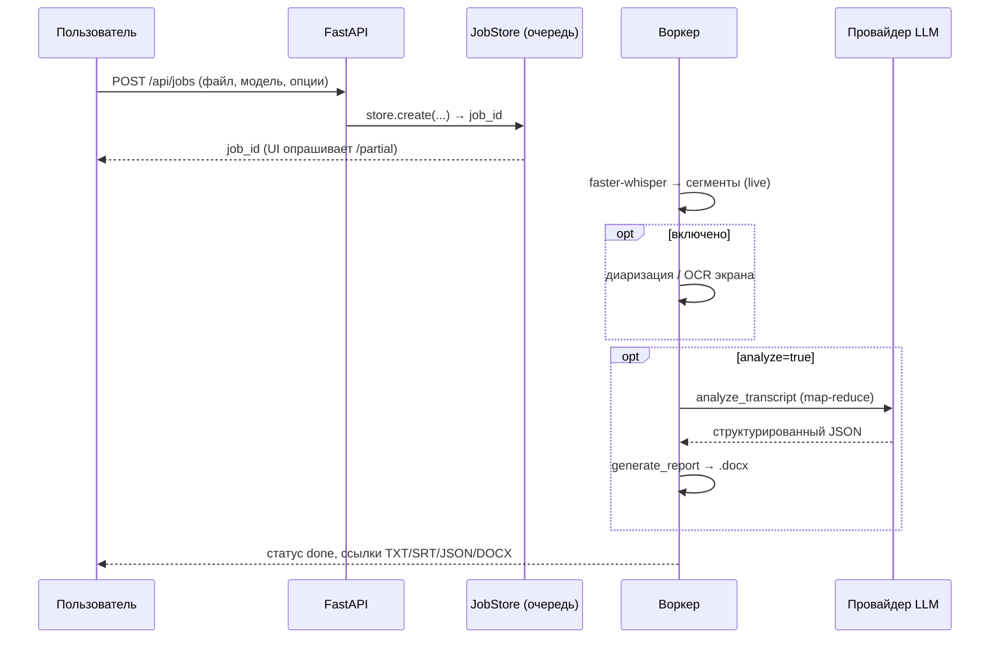
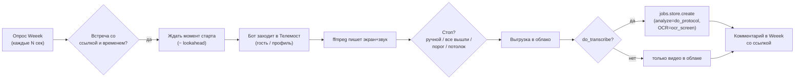

# Архитектура, стек и решаемые задачи — MeetFlowAI

Документ для разработчиков и техлидов: какие задачи закрывает система, из чего она
собрана, как устроены потоки данных и почему приняты те или иные решения.

Пользовательская инструкция — отдельно: [РУКОВОДСТВО.md](РУКОВОДСТВО.md).
Автоматизация описана ниже, в разделе про планировщик и рекордер.

---

## 1. Какие задачи решает

**Боль:** встречи отнимают время дважды — сначала на самой встрече, потом на
конспектировании, оформлении протокола и постановке задач. Записи лежат
мёртвым грузом, по ним никто не возвращается.

**Что закрывает система:**

| Задача | Как решается |
|---|---|
| Не вести конспект руками | ASR превращает запись в полный текст (TXT/SRT/JSON) |
| Быстро понять «что решили / кто что должен» | ИИ собирает протокол: решения, задачи, **ответственные** |
| Правильные имена и термины | подсказка `initial_prompt` + глоссарий замен |
| «Кто говорил» | опциональная диаризация (pyannote) |
| Учесть то, что показывали на экране | OCR кадров видео (Tesseract) |
| Поделиться итогом | экспорт в **Word (.docx)**, по файлу на движок |
| Приватность конфиденциальных встреч | распознавание и (опц.) ИИ — **локально**, без облака |
| Рутина «зайти-записать-расшифровать» | **автоматизация**: бот сам пишет встречу из Weeek-задачи и гонит её по конвейеру |

**Ключевой принцип:** локально по умолчанию; всё, что уходит наружу (облачный
LLM, облако для записей), — явный выбор пользователя.

---

## 2. Обзор архитектуры

Две независимые «половины»: **ядро** (ручной конвейер «файл → текст → протокол») и
**автоматизация** (которая оркестрирует то же ядро вокруг живых встреч). Связаны
они в одной точке — `scheduler` кладёт запись в `jobs.store.create(...)`, как будто
её загрузил пользователь.

---

## 3. Технологический стек

| Слой | Технологии | Зачем |
|---|---|---|
| Язык | **Python 3.12** | 3.14 несовместим с ctranslate2/onnxruntime |
| Веб-сервер | **FastAPI**, Starlette, **uvicorn**, **Pydantic** | REST API; весь интерфейс — React-SPA. Jinja остался только на страницах входа/регистрации/восстановления |
| Фронтенд | **ванильный JS + CSS** (без фреймворка) | лёгкая «стеклянная» тема, минимум зависимостей |
| Распознавание | **faster-whisper** (бэкенд **CTranslate2** 4.4.0, int8, CPU) | локальный ASR без GPU; пин версии — стабильность |
| Протокол (LLM) | **Ollama** (локально) + облачные по REST; SDK **anthropic** | выбор движка, бесплатно/локально по умолчанию |
| Word | **python-docx** | генерация .docx протокола |
| OCR экрана | **pytesseract** + бинарь **Tesseract**, **Pillow**, **PyAV** | распознать слайды/код с видео |
| Диаризация (опц.) | **pyannote.audio** + **torch** (CPU) | «кто говорил», по HF-токену |
| Автоматизация браузера | **Playwright** + **Chromium** | бот заходит в Телемост (API ботов нет) |
| Захват A/V | внешний **ffmpeg** (`x11grab` экран Xvfb + `pulse` звук) | запись встречи на Linux-сервере |
| Облака | **Яндекс.Диск REST**, **Google Drive REST** (OAuth2), локальная ФС | хранение записей; реализованы на stdlib `urllib` |
| Таск-трекер | **Weeek REST** (`/public/v1`) | источник встреч (ссылка + время) |
| Таймзоны | **zoneinfo** + **tzdata** | slim-образ без системной базы TZ |
| Сеть к внешним API | **urllib** (stdlib) + ретраи/бэкофф | без лишних зависимостей |
| Параллелизм | **threading**, `queue.Queue` | воркер задач, демон-планировщик |
| Конфиг/секреты | env-переменные (ядро) + таблица `user_settings` в Postgres (автоматика) | секреты автоматики переживают рестарт |

---

## 4. Потоки данных

### 4.1. Ручной режим (распознавание + протокол)

Длинные транскрипты режутся на части с перекрытием (**map-reduce**), чтобы LLM
охватил всю встречу. Пауза/отмена — кооперативные: воркер проверяет флаги
`_control` между сегментами и между чанками (исключение `AnalysisCancelled`).

### 4.2. Автоматический режим (Weeek → запись → облако → протокол)

Запись и выгрузка — всегда; распознавание и протокол — независимые флаги. Одна
запись за раз (браузер+ffmpeg эксклюзивны). Окно «позднего входа» не даёт зайти в
давно законченную встречу после рестарта.

---

## 5. Карта модулей

| Файл | Ответственность |
|---|---|
| `app/main.py` | FastAPI: эндпоинты, отдача React-SPA (единственный серверный шаблон — `login.html`), старт планировщика |
| `app/config.py` | конфиг из env, список моделей/провайдеров, рантайм-ключи |
| `app/jobs.py` | `JobStore`: очередь, воркер, пауза/отмена, персист задач, ретеншн |
| `app/transcribe.py` | `faster-whisper`, кэш модели на один слот (перезагрузка при смене) |
| `app/analyze.py` | сборка протокола, map-reduce, схема JSON, `AnalysisCancelled` |
| `app/llm.py` | провайдеры LLM (Ollama/NVIDIA/Gemini/Groq/Yandex/GigaChat/Anthropic), ретраи, ротация ключей, SSE-стриминг у NVIDIA |
| `app/docx_export.py` | рендер Word-протокола |
| `app/diarize.py` | диаризация (pyannote), проверки готовности |
| `app/screen_ocr.py` | сэмплинг кадров (PyAV) + OCR (Tesseract) |
| `app/glossary.py`, `formats.py` | замены терминов, экспорт TXT/SRT/JSON |
| `app/ollama_setup.py` | установка Ollama по требованию (прогресс/отмена) |
| `app/automation/settings.py` | постоянные настройки/токены команды (секреты зашифрованы) |
| `app/automation/weeek.py` | клиент Weeek: встречи, ссылка на Телемост, время |
| `app/automation/clouds/` | `local` / `yandex_disk` / `gdrive` + общий диспетчер |
| `app/automation/recorder/` | `browser.py` (Playwright), `capture.py` (ffmpeg), оркестратор |
| `app/automation/scheduler.py` | демон-цикл, состояния встреч, ручной запуск/стоп |

---

## 6. Модель потоков (concurrency)

- **Веб** — асинхронный uvicorn; обработчики синхронные и быстрые (ставят задачи,
  читают статус).
- **Воркер задач** — один фоновый поток + `queue.Queue`. Сознательно **один**:
  ASR и LLM тяжёлые, параллелить на одном CPU смысла нет. Пауза/отмена — через
  словарь флагов `_control`.
- **Очиститель** — поток ретеншна (удаляет старые результаты).
- **Планировщик** — отдельный демон-поток; гейт по `enabled`. Каждая запись/задача
  обрабатывается в своём коротком потоке; встреча «забивается» атомарно
  (`scheduled→recording` под локом) перед стартом, чтобы тик не запустил дубль.
- **Параллельные записи — по слотам** (`recorder.acquire_slot`): пул из
  `VTX_MAX_CONCURRENT_RECORDINGS` слотов (по умолчанию 4), у каждого свой экран
  Xvfb и свой приёмник звука PulseAudio (`meet0…meet3`). Слот занимается на
  время записи и освобождается сразу после неё — выгрузка и запись полей Weeek
  идут уже без него. Дубль бота исключается тем, что встреча атомарно
  «забивается» под локом (`scheduled→recording`) до старта.
  Единого PID-файла `recorder.lock` нет: он был из времён одной записи за раз.
- **Стоп записи** — `threading.Event`, который читает `should_stop` рекордера.

---

## 7. Хранение и состояние

| Что | Где | Живёт ли после рестарта |
|---|---|---|
| Загрузки и результаты | `data/uploads`, `data/results` | да (до автоудаления по ретеншну) |
| Метаданные задач | таблица `jobs` | да (незавершённые помечаются прерванными) |
| Записи встреч | `data/recordings` или облако | да |
| Настройки/токены автоматики | таблица `user_settings` | **да** — бот не теряет доступ |
| API-ключи LLM ядра | переменные окружения / в памяти | только пока заданы в окружении |
| Live-прогресс (стрим текста) | в памяти | нет |

Осознанная асимметрия: ключи **ядра** — в памяти/окружении (ручной запуск), а
секреты **автоматики** — на диске, потому что сервер работает без человека 24/7.

---

## 8. Точки расширения

- **Новый LLM-движок** — класс-провайдер в `llm.py` + регистрация в `config.py`.
- **Новое облако** — модуль в `clouds/` с `readiness()`/`upload()` + запись в `BACKENDS`.
- **Другой захват A/V** (например Linux: x11grab + PulseAudio) — за тем же
  интерфейсом `capture.build_ffmpeg_cmd` / `FFmpegRecorder`.
- **Другой трекер вместо Weeek** — клиент по образцу `weeek.py`, возвращающий
  `Meeting(url, start, …)`; планировщик и остальное не меняются.
- **Селекторы Телемоста** — списки кандидатов в `recorder/browser.py`.

---

## 9. Осознанные решения и ограничения (trade-offs)

- **CPU-only, int8, один воркер** — рассчитано на обычный ноутбук/сервер без GPU;
  пропускная способность принесена в жертву простоте и предсказуемости памяти.
- **Минимум зависимостей** — облака и внешние API на stdlib `urllib`, без
  тяжёлых SDK (исключение — `anthropic`). Меньше веса и конфликтов версий.
- **Бот-рекордер вместо API** — у Телемоста нет публичного API ботов; запись через
  браузер **по своей природе хрупкая** (вёрстка, капча, вход). Поэтому: подробные
  логи, скриншот при неудаче, ручной фолбэк, гарантированные стопы (кнопка +
  потолок по времени).
- **Пины версий** (`ctranslate2==4.4.0`, Python 3.12) — стабильность важнее
  свежести; новые версии ломали распознавание.
- **Локальность по умолчанию** — наружу уходит только то, что пользователь явно
  включил (облачный LLM или облако для записей).
