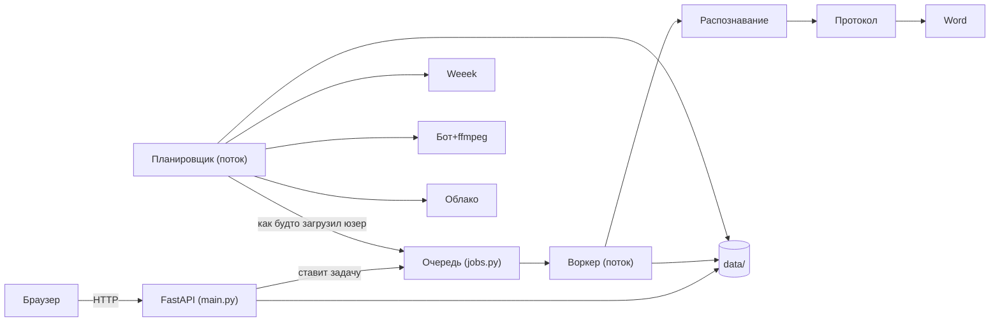

# 🖥 Бэкенд — очень понятно

Как устроен сервер изнутри: из каких «кирпичиков» собран, что происходит при каждом
запросе, как работает очередь задач, планировщик и бот, вся таблица API и как это
**разрабатывать и запускать**. Написано так, чтобы разобрался и новичок.

Архитектурный обзор и диаграммы потоков — в **[Архитектура](АРХИТЕКТУРА.md)** и
**[Диаграммы](ДИАГРАММЫ-UML-BPMN.md)**.

---

## 1. Общая идея за 30 секунд

Есть **веб-сервер** (FastAPI). Он принимает запросы от браузера. Тяжёлую работу
(распознавание, протокол) он **не делает сам** — он кладёт «задачу» в **очередь**,
а её выполняет отдельный **воркер** (фоновый поток), по одной задаче за раз. Рядом
живёт **планировщик** — ещё один фоновый поток, который сам ходит в Weeek, находит
встречи и запускает **бота** для записи. Всё состояние (задачи, настройки, записи)
лежит в папке `data/`.



Две «половины»: **ручной конвейер** (файл → текст → протокол) и **автоматизация**
(та же обработка, но вокруг живых встреч). Соединяются в одной точке: планировщик
кладёт запись в ту же очередь `jobs`, как будто её загрузил пользователь.

---

## 2. Жизненный цикл запроса (что происходит по шагам)

**Пример: пользователь загрузил файл для распознавания с протоколом.**

1. Браузер шлёт `POST /api/jobs` (файл + опции).
2. **Гейт авторизации** (`_auth_gate` в `main.py`) проверяет сессию-cookie. Нет
   сессии → `401`/редирект на `/login`.
3. Обработчик сохраняет файл в `data/uploads`, проверяет размер и формат.
4. Вызывает `store.create(...)` → создаётся объект **Job** (статус `queued`) и
   кладётся в `queue.Queue`. Пользователю сразу возвращается `job_id`.
5. **Воркер** (фоновый поток) забирает задачу, ставит `running`.
6. `transcribe_file(...)` гонит **faster-whisper**; сегменты появляются по одному —
   их видно в UI через `GET /api/jobs/{id}/partial` (опрос каждые 1.5 c).
7. Если включено — диаризация / **определение говорящего по видео** / OCR экрана.
8. Пишутся результаты (TXT/SRT/JSON) в `data/results`.
9. Если `analyze=true` — статус `analyzing`, `analyze_transcript(...)` собирает
   протокол (map-reduce), `generate_report(...)` пишет `.docx`.
10. Статус `done`. UI показывает ссылки на скачивание.

Пауза/отмена — **кооперативные**: воркер проверяет флаги между сегментами и
чанками (исключения `JobCancelled` / `AnalysisCancelled`).

---

## 3. Карта модулей (что за что отвечает)

### Ядро (`app/`)

| Файл | Ответственность |
|---|---|
| `main.py` | FastAPI: все эндпоинты, гейт авторизации, рендер `login.html` (единственный серверный шаблон), отдача React-SPA на `/app` (статика `/app/assets` + fallback на `index.html` для клиентского роутинга), старт планировщика. |
| `config.py` | Конфиг из переменных окружения, списки моделей/провайдеров, рантайм-ключи. |
| `jobs.py` | `JobStore`: очередь, один воркер, пауза/отмена, персист задач, ретеншн, весь конвейер задачи. |
| `transcribe.py` | Обёртка над faster-whisper; модель кэшируется (одна за раз), перезагружается при смене. |
| `analyze.py` | Сборка протокола: схема JSON, промпт, **map-reduce** для длинных встреч, `AnalysisCancelled`. |
| `llm.py` | Абстракция LLM-провайдеров (Ollama/свой ключ/Gemini/Groq/Yandex/GigaChat/Anthropic), ретраи, **ротация ключей** при лимите и при отказе ключа. |
| `docx_export.py` | Рендер Word-протокола (`generate_report`). |
| `formats.py` | Экспорт сегментов в TXT/SRT/JSON (с метками спикеров). |
| `glossary.py` | Замены «как слышится → правильно» в тексте. |
| `diarize.py` | Диаризация по звуку (pyannote); `readiness()`. |
| `screen_ocr.py` | Сэмплинг кадров (PyAV) + OCR (Tesseract) текста с экрана. |
| `speaker_id.py` | **Определение говорящего по видео**: зелёная подсветка + OCR имени → метки сегментов. |
| `security.py` | Авторизация, сессии, хэш паролей, шифрование секретов под ключ пользователя, **одноразовые коды восстановления** (`generate_recovery_code`/`confirm_recovery_code`, хеш+TTL+лимит попыток в `recovery.json`). |
| `user_creds.py` | Пул API-ключей LLM пользователя (зашифрован). |
| `sms.py` | Отправка SMS для кода восстановления пароля. Провайдер по env: **SMS.ru** (`VTX_SMSRU_API_ID`) либо «console»-заглушка (код в лог) до настройки шлюза. |
| `stats.py` | **Бизнес-метрики «Обзора»**. Задачи чистятся ретеншном (`VTX_RETENTION_HOURS`, сутки), поэтому итог КАЖДОЙ завершённой встречи (длительность, спикеры, число поручений/решений/участников, был ли протокол, успех) пишется отдельной строкой в `meeting_stats` при финальном статусе job — и переживает чистку. `summary(user, days)` агрегирует по команде. Все цифры измеренные; единственная оценка — «сэкономлено на протоколах» = часы × `VTX_MINUTES_COEFF` (0.5), в UI подписана как оценка. |
| `db.py` | **PostgreSQL-бэкенд** (psycopg 3, пул соединений). Когда задан `DATABASE_URL`, вся структурированная информация (users/sessions/recovery/jobs/settings/creds/meetings/ai_context) хранится в БД вместо JSON-файлов; модули (`security`, `jobs`, `settings`, …) прозрачно вызывают его вместо файловых чтений/записей. Логика приложения не меняется. Схема нормализованная (JSONB — только для реально документных полей: `jobs.analysis`/участники/движки и bag настроек). Пустой `DATABASE_URL` = файловый бэкенд (тесты/локалка). Медиа-файлы всегда на диске/в облаке. |
| `autosetup.py` | **Авто-настройка при первом запуске**: в фоне доустанавливает OCR-движок, ffmpeg, Chromium бота и скачивает все модели речи. `VTX_AUTO_SETUP=0` отключает. |
| `ollama_setup.py`, `whisper_setup.py`, `deps_setup.py` | Установка/подготовка зависимостей и моделей (`whisper_setup.preload_all`, `deps_setup._apt_install`). |

### Автоматизация (`app/automation/`)

| Файл | Ответственность |
|---|---|
| `scheduler.py` | Демон-цикл: опрос Weeek, состояния встреч (`MeetingState`), запуск/стоп записи, конвейер, форс-опрос. |
| `weeek.py` | Клиент Weeek: находит встречи (ссылка + время), читает кастом-поля (в т.ч. булеву «Запись встречи»), пишет ссылки/комментарии. **Пагинация:** страница максимум 100 задач, поэтому `list_tasks` идёт по `offset` (НЕ `page` — он игнорируется) до `max_tasks=500` и тянет страницы **параллельно** (последовательно 5 страниц ≈15 с — кнопка «Обновить» казалась мёртвой; параллельно ≈4 с). Без пагинации встречи дальше первых 100 (например, старая задача, **перенесённая** в будущее) вообще не находились. **Время:** см. `parse_start` ниже. |
| `settings.py` | Постоянные настройки/токены команды (секреты зашифрованы; хранилище — см. §14). |
| `recorder/__init__.py` | Оркестратор записи: **слоты** параллелизма, `record_meeting(...)`. |
| `recorder/browser.py` | Заход в Телемост через Playwright/Chromium (гость/профиль), списки селекторов. |
| `recorder/capture.py` | Захват экрана+звука через ffmpeg (x11grab + PulseAudio, **fragmented MP4** — файл читается даже после kill -9). |
| `clouds/` | Выгрузка: `yandex_disk.py`, `gdrive.py`, `local.py` + общий диспетчер `upload()`/`readiness()`. |
| `notify.py` | Telegram-уведомления команды (bot API): «протокол готов», «нет звука». |

---

## 4. Очередь задач — `jobs.py` (сердце ядра)

- **`JobStore`** держит все задачи, `queue.Queue` и запускает при старте два потока:
  **воркер** (выполняет задачи) и **очиститель** (ретеншн старых результатов).
- **Почему один воркер?** ASR и LLM тяжёлые; на одном CPU параллелить смысла нет —
  так память предсказуема, а поведение простое.
- **`Job`** (dataclass) — вся задача: `id`, `owner`, `filename`, `status`,
  `progress`, опции (`analyze`, `diarize`, `capture_screen`, `identify_speakers`,
  `provider`, `model`, …) и результаты (`analysis`, `docx_providers`, ошибки).
- **Пауза/отмена** — через словарь флагов `_control[job_id]`, читаемый в колбэках.
- **Персист** — таблица `jobs` (без базы — файл, см. §14). При рестарте незавершённые задачи помечаются
  прерванными; задачи «на анализе» оставляют текст и предлагают «Повторить анализ».
- **Изоляция** — каждый per-job эндпоинт проверяет `job.owner == текущий_логин`.

Главный метод конвейера (упрощённо): `transcribe → (diarize?) → (speaker_id?) →
форматы → (screen_ocr?) → (analyze? → docx)` — ровно в этом порядке, всё
best-effort: сбой опции не ломает распознавание.

---

## 5. Распознавание — `transcribe.py`

- Одна модель **faster-whisper** в памяти (кэш), перезагружается при смене размера.
- `transcribe_file(...)` возвращает список **`Segment`** (`start`, `end`, `text`,
  `speaker`, `avg_logprob`, `no_speech_prob`) и метаданные. Колбэк `on_segment`
  отдаёт сегменты по мере готовности — отсюда «живой» текст в UI. Метрики
  уверенности сохраняются в JSON-результат — UI подсвечивает неуверенные места.
- **Одно распознавание за раз** — глобальный замок `_transcribe_lock`: модель
  одна, и параллельная инференция на CPU замедлила бы обе задачи (своп). Очередь
  задач FIFO; live-расшифровка берёт замок без ожидания (`nonblocking=True`) и
  просто пропускает тик, если модель занята настоящей задачей.
- **Анти-галлюцинации**: сегмент с `no_speech_prob > 0.6` И `avg_logprob < -1.0`
  («выдуманная» фраза на тишине) отбрасывается до попадания в live-поток;
  ≥ 3 одинаковых сегмента подряд (зацикливание) схлопываются в один. Пороги —
  `VTX_NS_PROB_MAX` / `VTX_LOGPROB_MIN` / `VTX_REPEAT_COLLAPSE_AT`.
- **Авто-`initial_prompt`** (собирает `jobs._auto_initial_prompt`, ~224 токена,
  приоритет по убыванию): ручная подсказка задания → имена людей (постоянный
  AI-контекст команды + подписи плиток с прошлых видео, отфильтрованные
  «похоже на имя») → названия проектов → правильные написания из глоссария.
  Whisper пишет знакомые имена/термины как в подсказке, а не «по слуху».
- Видео поддерживается напрямую (звук извлекается через PyAV/ffmpeg).

---

## 6. Протокол — `analyze.py` + `llm.py`

**`analyze.py`:**
- Анализ получает расшифровку **с таймкодами и спикерами** (не плоский текст).
  Короткий текст → один проход; длинный (> порога) → **map-reduce**: map
  возвращает не прозу, а **JSON фиксированной схемы** (Pydantic `MapNotes`) —
  темы с таймкодами и цитатами, решения, задачи с `owner`/`owner_evidence`/`done`.
  Дубли из зоны перекрытия склеиваются механически (±2 мин + схожесть текста);
  reduce получает части хронологически — порядок тем протокола = ход встречи.
- **Контракт со схемой**: Ollama получает JSON-схему как грамматику структурного
  вывода (невалидный ответ невозможен); облачные ответы валидируются Pydantic с
  одним повтором (текст ошибки — в промпт). Провал не роняет чанк.
- **Контроль контекста**: если заметки всех частей не влезают в 0.8 окна движка —
  иерархический reduce (попарное слияние соседних частей, при сбое —
  механическое без потерь). `num_ctx` Ollama подбирается под запрос (потолок
  `VTX_OLLAMA_NUM_CTX`=32768, Modelfile тоже 32768).
- **Схема протокола** (JSON): участники, summary, подробные темы, ключевые мысли,
  выводы, решения, выполненные задачи, задачи+ответственные, мелкие задачи.
  decisions = содержательные решения (что выбрали/отклонили/отложили), НЕ
  пересказ задач и не «итого» встречи.
- **Правила промпта:** писать простым языком «для того, кого не было»; темы
  самодостаточны (10–12 предложений); **ответственных не угадывать** (owner только
  при явном «я возьму»/поручении по имени); метки-имена из видео считаются
  достоверным автором; отдельный проход за «мимоходными» поручениями.
- **`verify_protocol` (grounding, Д5)**: после сборки каждый пункт задач/решений
  должен получить ДОСЛОВНУЮ цитату-основание с таймкодом. Дословность и
  релевантность проверяются механически (нормализация + подстрока; общие
  стем-слова цитаты/её строки с пунктом) — перефраз и «настоящая цитата к
  выдуманному пункту» отклоняются. Непойденное → `verification[...].ok=false`
  (серым «⚠ проверьте» в UI/DOCX); owner без `owner_ok` снимается. Тумблер
  «Строгая проверка» (вкл по умолчанию).
- **Заметки участника (Д6)**: блок «ЗАМЕТКИ УЧАСТНИКА» с приоритетом над
  расшифровкой — скелет протокола; в grounding проверяются раньше расшифровки
  (основание «из заметок»).
- **Пресеты (Д11)**: `PROTOCOL_PRESETS` — планёрка/дизайн/демо/1:1/универсальный
  (те же поля, разные акценты); `preset_for_title` подбирает по названию встречи;
  свои пресеты команды — `custom_presets` в настройках.
- **Участники строго по плиткам**: `jobs._enforce_participants` механически
  заменяет список участников на подписи плиток Телемоста этого звонка —
  человек, о котором лишь говорили, в «Участники» не попадает. Роли модели
  сохраняются у совпавших имён; без плиток — по тексту, как раньше.
- **Дожим (Д13)**: `regen_topic_details` переписывает ОДНУ тему по расшифровке;
  `ask_meeting` — вопрос по встрече: дешёвый ретрив релевантных окон + ответ с
  обязательными таймкодами (или честное «не обсуждалось»).

**`llm.py`:**
- Единый интерфейс `complete(...)` для всех провайдеров.
- **`_RotatingProvider`**: если у пользователя несколько ключей — при ошибке лимита
  (429) сам переключается на следующий; если все исчерпаны — понятная ошибка.
- **`_FallbackChain`** (`get_provider_chain`): при недоступности выбранного движка
  (5xx, сеть, все ключи в лимите) запрос уходит следующему настроенному
  провайдеру (бесплатные/локальные первыми) — упавшая Gemini не срывает
  протокол. Цепочка помнит рабочий движок и пропускает провайдера, которому
  на большой ответ осталось < 4000 токенов (иначе JSON пришёл бы обрезанным).
- `get_provider(name, keys)` строит нужный провайдер (локальный Ollama стримит
  токены — отсюда живой протокол в UI); Ollama принимает `json_schema` как
  грамматику структурного вывода.

---

## 7. Кто говорил — `speaker_id.py` (ключевая фича)

Расшифровка звука **не знает**, кто говорит. Поэтому имя берётся **с видео**:

1. Сэмплируем кадры (PyAV, ~каждые 1.5 c).
2. Находим **зелёную рамку активного участника** (numpy-маска цвета + проверка,
   что это именно рамка-прямоугольник вокруг плитки, а не зелёная одежда/фон).
3. **OCR** имени в подписи плитки (Tesseract, рус+англ).
4. Строим таймлайн «кто-когда» и подписываем каждый сегмент по перекрытию времени —
   в то же поле `Segment.speaker`, что и диаризация.

Пороги настраиваются через `VTX_SPEAKER_*`. Всё best-effort: не распозналось — текст
просто без имён, распознавание не ломается.

---

## 8. Планировщик — `scheduler.py` (сердце автоматизации)

- Отдельный **демон-поток** `_loop`. Для **каждого** пользователя под его токенами:
  раз в `poll_interval_sec` вызывает `_poll(...)` (опрос Weeek) и на каждом тике —
  `_maybe_trigger(...)` (пора ли писать).
- **`MeetingState`** — встреча и её статус (`scheduled/recording/uploading/
  transcribing/analyzing/done/missed/skipped/error`), плюс `record_flag` (галочка
  Weeek) и `job_id`.
- **`_passes_filter(...)`** решает, писать ли: ручной выбор > **галочка Weeek
  «Запись встречи»** > режим по умолчанию + фильтры (слова/время/дни).
- **`_maybe_trigger(...)`**: в окне `[start − lookahead, start + grace]` берёт
  свободный **слот** и запускает `_run(...)` в коротком потоке. Прошедшие до старта
  сервиса встречи → `missed` (защита от «догона»).
- **`_run(...)`**: запись → облако → создание задачи в `jobs.store` (флаги
  распознавания/протокола/OCR/спикеров) → комментарий в Weeek. Живой статус после
  записи берётся из состояния самой задачи (`_enrich_from_job`).
- **`poll_now(user)`** — принудительный опрос (кнопка «Обновить статус»).
- **`status(user)`** — то, что видит UI: список встреч с живыми статусами.
- **Доставка живёт в задаче**, а не в потоке планировщика: job создаётся с
  `deliver_protocol_cloud`/`deliver_weeek_task`, поэтому выгрузка протокола и
  ссылка в Weeek переживают рестарты и повторяются при «Пересобрать». Ожидатель
  `_await_and_upload_protocol` теперь только ждёт и ОБЪЯСНЯЕТ исход комментарием
  в Weeek (пустое поле «Протокол» всегда объяснено).
- **`_resume_pending`** при старте: встречи, замороженные рестартом, подхватываются —
  готовый протокол прикрепляется сразу, бегущий — по завершении; запись,
  оборванная ПОСРЕДИ (kill -9/OOM), находится по `out_path` из снапшота и
  дообрабатывается (`_finalize_orphan`): облако → поле «Видео» → распознавание.
- **Live-расшифровка (Д10)**: во время записи `_live_transcribe_loop` каждые
  `live_interval_min` (5) минут вырезает НОВЫЙ хвост растущего fMP4 и гонит через
  Whisper (без ожидания замка — пропускает тик, если модель занята); текст с
  таймкодами копится в `MeetingState.live_text`. `live_view()` отдаёт live-текст
  → partial распознавания → финальную расшифровку.
- **Заметки встречи**: `set_meeting_notes` хранит заметки на встрече (и в
  снапшоте) ещё ДО появления job; при создании job уходят в `user_notes`, при
  обновлении пробрасываются в существующий job.
- **Уведомления (`notify.py`)**: Telegram-бот команды — «📄 протокол готов» (со
  ссылкой), «⚠ протокол не собрался», «⚠ нет звука». Токен шифруется как прочие
  секреты настроек.

---

## 9. Бот и захват — `recorder/`

- **Слоты параллелизма** (`acquire_slot`/`release_slot`): до
  `VTX_MAX_CONCURRENT_RECORDINGS` записей одновременно, каждая — свой виртуальный
  экран (Xvfb `:99…`) и свой аудио-синк PulseAudio (`meet0…`). Изоляция полная.
- **`browser.py`**: Playwright/Chromium заходит в Телемост гостем (микрофон/камера
  выкл., тихий фейк-мик), окно развёрнуто на весь виртуальный экран. Списки
  селекторов-кандидатов на случай смены вёрстки; скриншот при неудаче.
- **`capture.py`**: ffmpeg пишет `x11grab` (экран этого дисплея) + `pulse`
  (монитор этого синка). Стоп — по `threading.Event`. Формат — **fragmented MP4**
  (`-movflags +frag_keyframe+empty_moov`): kill -9/OOM посреди встречи оставляет
  ЧИТАЕМЫЙ файл до последнего фрагмента, а не труп без moov atom; имя `.mp4` и
  конвейер ниже не меняются. Это же позволяет live-расшифровку по растущему файлу.
- **Сторож звука (Д9)**: во время записи каждые 30 с замеряется уровень
  PulseAudio-монитора слота (мониторы позволяют второго читателя); 2 минуты
  тишины подряд → «⚠ НЕТ ЗВУКА» в живом логе карточки + Telegram; в итоге
  записи — пометка о немых периодах.
- **`record_meeting(...)`**: пишет в переданный СЛОТ (свой Xvfb + свой
  PulseAudio-приёмник). Слот берётся вызывающим из пула `acquire_slot()` и
  освобождается сразу после записи. Дубль бота исключается на уровне
  планировщика: встреча атомарно переводится `scheduled→recording` под локом.

---

## 10. Weeek — `weeek.py`

- Только `urllib` (без тяжёлых SDK) + ретраи с бэкофом и `Connection: close`
  (Weeek иногда обрывает большой ответ — это молча ломало опрос).
- `upcoming_meetings(...)` → список `Meeting` (task_id, title, url, start,
  project_id, raw). Ссылка на Телемост ищется в кастом-полях (сначала link-поля),
  описании, названии.
- **`list_tasks` — пагинация обязательна.** Weeek отдаёт максимум 100 задач за
  запрос и флаг `hasMore`; листаем по **`offset`** (параметр `page` Weeek
  игнорирует!) до `max_tasks=500`, страницы тянем **параллельно**
  (`ThreadPoolExecutor`) — последовательно это ≈15 с на 5 страниц. Иначе
  встречи за пределами первой сотни (в частности **перенесённая** старая задача)
  не находятся вообще.
- **`parse_start` — ГЛАВНАЯ ловушка с часовыми поясами.** Для одиночных встреч
  Weeek отдаёт `date` **в UTC-дате**, а `time` — в **локальном** времени
  воркспейса. Это РАЗНЫЕ пояса, их нельзя склеивать: около полуночи получается
  сдвиг на сутки (встреча 00:25 уезжала на предыдущий день и пряталась из
  фильтра «Сегодня»). Достоверный источник — полный UTC-таймстамп. Порядок:
  1. `startDateTime` — НАЧАЛО диапазона (никогда не `dueDateTime`: это КОНЕЦ);
  2. **`dueDateTime`** — для одиночных встреч это и есть время встречи;
  3. только если их нет — запасной вариант `date` + локальное `time`.
  Наружу всегда UTC (`isoformat()` с оффсетом), фронт переводит в локаль браузера.
  Регрессионные тесты: `tests/test_weeek_time.py`.
- `custom_field_bool(task, name)` — читает булеву галочку (напр. «Запись встречи»),
  терпима к разным форматам значения.
- Запись: `set_custom_field(...)` (ссылки в поля, формат `{fieldId: "строка"}`),
  `add_comment(...)`.

---

## 11. Облака — `clouds/`

- Единый `upload(file, name, settings, backend=None, folder=None)` и `readiness()`.
- Реализации: `yandex_disk.py` (REST по токену), `gdrive.py` (REST OAuth2),
  `local.py` (копирование в папку). Всё на stdlib `urllib`.
- Протоколы уходят в **отдельную** папку (не туда, где видео).

---

## 12. Безопасность — `security.py`

- **Пароли:** PBKDF2-HMAC-SHA256 (200 000 итераций, своя соль), сравнение
  постоянное по времени.
- **Сессии:** `secrets.token_urlsafe(32)` в cookie `vtx_session` (HttpOnly,
  SameSite=Lax, Secure при `VTX_HTTPS=1`), срок `VTX_SESSION_TTL_HOURS`.
- **Секреты:** Fernet/AES; master-key (`VTX_SECRET_KEY` или `data/secret.key`), из
  него через HKDF — **отдельный ключ на каждый логин**. Чужой логин чужие секреты
  не расшифрует.
- **Изоляция:** данные/токены в `data/users/<логин>/…`; каждый per-job эндпоинт
  проверяет владельца.

Подробнее — **[Безопасность](БЕЗОПАСНОСТЬ.md)**.

---

## 13. Полная таблица API

> Всё под гейтом авторизации, кроме `/login`, `/register`, `/recover`, `/healthz`
> и публичных auth-API (`login`, `register`, `recover/request`, `recover/verify`).
>
> **Таблица ниже генерируется** из самих маршрутов: `python scripts/gen_api_table.py`.
> Руками её не правьте — она уже один раз разошлась с кодом (числились удалённые
> маршруты, полутора десятков живых не было вовсе). Меняете маршруты — перезапустите
> скрипт.

<!-- API:начало -->

### Аутентификация и профиль

| Метод | Путь | Назначение |
|---|---|---|
| POST | `/api/auth/login` | Вход по логину и паролю; ставит cookie сессии. |
| POST | `/api/auth/logout` | Выход: гасит сессию и снимает cookie. |
| POST | `/api/auth/recover/request` | Step 1 — send a one-time code to the registered phone (if login+phone match). |
| POST | `/api/auth/recover/verify` | Step 2 — check the code and set the new password; revokes all sessions. |
| POST | `/api/auth/register` | Регистрация: создаёт учётку и сразу открывает сессию. |
| GET | `/api/profile` | Профиль: логин, маска телефона, роль, команда, код приглашения. |
| POST | `/api/profile/delete` | Permanently delete the current account (login, phone, all data). |
| POST | `/api/profile/password` | Change the password, confirming identity by old password OR by phone. |
| POST | `/api/profile/phone` | Change the recovery phone; requires the CURRENT password. |
| POST | `/api/profile/team/remove` | Remove a member from the admin's workspace (they get their own empty one and are logged out immediately). |

### Задачи распознавания

| Метод | Путь | Назначение |
|---|---|---|
| GET | `/api/jobs` | Список задач команды. |
| POST | `/api/jobs` | Создать задачу распознавания: файл плюс опции обработки. |
| GET | `/api/jobs/{job_id}` | Одна задача: статус, прогресс, результаты. |
| PATCH | `/api/jobs/{job_id}/analysis` | Д13: save the user's manual protocol edits (docx re-renders). |
| POST | `/api/jobs/{job_id}/ask` | Д13: chat over the meeting — answer with timecodes from the transcript. |
| POST | `/api/jobs/{job_id}/cancel` | Остановить задачу; уже распознанная часть сохраняется. |
| POST | `/api/jobs/{job_id}/notes` | Attach the participant's live meeting notes to a job (Д6). |
| POST | `/api/jobs/{job_id}/opened` | Человек открыл протокол встречи (docs/ТЗ-МЕТРИКИ.md И7, И9—И11). |
| GET | `/api/jobs/{job_id}/partial` | Live transcript-so-far for the streaming UI. |
| POST | `/api/jobs/{job_id}/pause` | Пауза: воркер замирает между сегментами, сделанное сохраняется. |
| POST | `/api/jobs/{job_id}/reanalyze` | Пересобрать протокол по той же расшифровке — без повторного распознавания. |
| POST | `/api/jobs/{job_id}/redeliver` | Re-attempt the protocol DELIVERY only (cloud upload + Weeek link) — for when the protocol built fine but the upload/attach failed. |
| POST | `/api/jobs/{job_id}/regen-topic` | Д13: re-generate ONE topic of the protocol via the LLM. |
| GET | `/api/jobs/{job_id}/result` | Результат задачи в выбранном формате: txt, plain, srt, json, docx, screen. |
| POST | `/api/jobs/{job_id}/resume` | Продолжить приостановленную задачу. |
| POST | `/api/jobs/{job_id}/retry` | Re-run a failed/cancelled recognition job from scratch (same file+options). |
| GET | `/api/jobs/{job_id}/weeek-tasks` | Черновики задач протокола для Weeek + участники воркспейса. |
| POST | `/api/jobs/{job_id}/weeek-tasks/create` | Создать отмеченные черновики в Weeek. |
| POST | `/api/jobs/{job_id}/weeek-tasks/prepare` | Пересобрать черновики из текущего протокола (созданные не теряются). |
| POST | `/api/jobs/{job_id}/weeek-tasks/{key}/skip` | Пометить черновик «не заводить» (задача в Weeek не создаётся). |
| GET | `/api/presets` | Д11: protocol presets — builtins + the team's custom ones. |
| POST | `/api/presets` | Save/update the team's custom preset (empty rules = delete). |
| GET | `/api/prompt/default` | The built-in analysis prompt, for the expert-mode editor. |
| GET | `/api/search` | Д14: full-text search over the team's transcripts and protocols. |
| GET | `/api/stats` | Business metrics for the Overview page, aggregated over the team. |
| GET | `/api/stats/owner` | Недельная таблица владельца сервиса по ВСЕМ командам (И56) и список спящих платящих (И48). |
| GET | `/api/stats/report` | Отчёт клиенту на одну страницу (docs/ТЗ-МЕТРИКИ.md И58): встречи, решения, задачи, сэкономленное время с формулой, надёжность словами и «укол в процесс». |

### Провайдеры LLM и контекст

| Метод | Путь | Назначение |
|---|---|---|
| GET | `/api/context` | Постоянный контекст команды для ИИ: общий текст и проекты. |
| POST | `/api/context` | Сохранить постоянный контекст команды. |
| GET | `/api/ollama/status` | Поднят ли локальный движок (Ollama) и есть ли на нём нужная модель. |
| GET | `/api/providers` | All known providers + which are usable for THIS user (their own keys). |
| POST | `/api/providers/connect` | Save an LLM API key IN THIS USER'S ACCOUNT (encrypted) and verify it. |
| POST | `/api/providers/custom/refresh` | Перечитать список моделей у поставщика сохранённым ключом. |
| POST | `/api/providers/disconnect` | Remove ALL of this user's saved keys for a provider. |
| GET | `/api/providers/keys` | This user's saved keys for a provider, MASKED — to browse/remove them. |
| POST | `/api/providers/keys/remove` | Remove ONE saved key of a provider by its index. |

### Готовность и модели

| Метод | Путь | Назначение |
|---|---|---|
| POST | `/api/model/download` | Download a Whisper model into the cache (background, no transcription). |
| GET | `/api/model/status` | Whether a Whisper model is downloaded + download progress. |
| GET | `/api/setup/auto` | Ход подготовки при старте (предзагрузка модели речи) + готовность компонентов. |
| GET | `/api/setup/deps` | Готовность необязательных компонентов (playwright/диаризация/ffmpeg/OCR). |
| GET | `/api/system/recommend` | Д15: recommend a Whisper model from the machine's RAM/CPU, so the user doesn't pick blind. |

### Автоматизация встреч

| Метод | Путь | Назначение |
|---|---|---|
| GET | `/api/automation/clouds/status` | Per-backend cloud readiness + which one is selected (for the UI). |
| POST | `/api/automation/clouds/test` | Upload a tiny test file to the selected (or given) cloud to verify creds. |
| GET | `/api/automation/meetings` | Upcoming meeting tasks from Weeek that carry a Telemost link. |
| POST | `/api/automation/meetings/links` | Manually attach the video and/or protocol link to a Weeek task — for meetings where automation could not deliver them (cloud refused the upload, the LLM was dow |
| POST | `/api/automation/meetings/{task_id}/decision` | Choose whether the bot records this specific meeting (overrides filters). |
| GET | `/api/automation/meetings/{task_id}/live` | Д10: live transcript while the bot records; the final transcript after. |
| GET | `/api/automation/meetings/{task_id}/notes` | Заметки участника по встрече. |
| POST | `/api/automation/meetings/{task_id}/notes` | Participant's notes typed during/after the meeting (Д6+Д10): stored on the meeting, forwarded to its recognition job as soon as it exists. |
| POST | `/api/automation/notify/test` | Send a test Telegram message with the team's saved token/chat (Д15). |
| GET | `/api/automation/recorder/audio-test` | Record a few seconds from the chosen audio device and report its level — so the user can verify the meeting's sound actually reaches it. |
| POST | `/api/automation/recorder/login` | Open a headed browser so the user logs into Yandex once (profile mode). |
| GET | `/api/automation/recorder/login-status` | Whether the recorder profile is logged into Yandex (for the UI hint). |
| POST | `/api/automation/recorder/login/action` | Клик, ввод текста, клавиша или переход — внутрь браузера входа своей команды. |
| POST | `/api/automation/recorder/login/close` | Закрыть окно входа в Яндекс на сервере (своей команды). |
| POST | `/api/automation/recorder/login/open` | Открыть сессию входа в Яндекс: браузер на СЕРВЕРЕ, экран — в интерфейсе. |
| GET | `/api/automation/recorder/login/screen` | Текущий экран браузера входа (PNG) — только своей команды. |
| GET | `/api/automation/recorder/status` | What the Telemost recorder needs (Playwright/ffmpeg/audio) — for the UI. |
| POST | `/api/automation/recorder/test` | Manually join a Telemost link and record for a few seconds, to verify the bot + capture work on this machine before automating. |
| POST | `/api/automation/scheduler/poll-now` | Force an immediate Weeek re-poll (the manual «Обновить статус» button). |
| POST | `/api/automation/scheduler/run-now` | Manually record a known meeting right now (poll Weeek first to populate). |
| GET | `/api/automation/scheduler/status` | Scheduler state + the meetings it's tracking and their pipeline status. |
| POST | `/api/automation/scheduler/stop-recording` | Stop recording(s): a specific meeting (task_id) or all of the user's. |
| GET | `/api/automation/settings` | Current automation settings (secrets redacted to presence flags). |
| POST | `/api/automation/settings` | Persist automation settings. |
| GET | `/api/automation/weeek/board-columns` | — |
| GET | `/api/automation/weeek/boards` | — |
| GET | `/api/automation/weeek/members` | Участники воркспейса Weeek (кэш на сутки в настройках команды) — для выбора исполнителя задачи из протокола. |
| GET | `/api/automation/weeek/probe` | Return the raw JSON of one Weeek task — used to pin date/link field names. |
| GET | `/api/automation/weeek/projects` | List the workspace's projects (id + name) so the user can pick which one to record. |
| POST | `/api/automation/weeek/user-map` | Запомнить «имя в протоколе → участник Weeek» для всей команды. |

### Прочее

| Метод | Путь | Назначение |
|---|---|---|
| GET | `/api/protocol-delivery/status` | Whether the manual page can push a protocol to cloud + Weeek. |
| GET | `/api/series` | Все серии команды: карточка, закреплённый тип, приоритет, итоги прошлой. |
| POST | `/api/series` | Создать/обновить карточку серии встреч. |
| DELETE | `/api/series/{key}` | — |
| POST | `/api/series/{key}/forget-last` | Стереть память о прошлой встрече серии (карточка остаётся). |

### Страницы и служебное

| Метод | Путь | Назначение |
|---|---|---|
| GET | `/` | React-SPA «MeetFlowAI» — весь интерфейс. |
| GET | `/docs` | Интерактивная документация OpenAPI (под гейтом авторизации). |
| GET | `/docs/oauth2-redirect` | Служебный маршрут Swagger UI. |
| GET | `/healthz` | Health-check. |
| GET | `/login` | Страница входа (Jinja). |
| GET | `/openapi.json` | Схема OpenAPI в JSON. |
| GET | `/recover` | Страница восстановления пароля (Jinja). |
| GET | `/redoc` | Та же схема OpenAPI в оформлении ReDoc. |
| GET | `/register` | Страница регистрации (Jinja). |

<!-- API:конец -->

---

## 14. Где что хранится

**Основной режим — PostgreSQL.** `docker-compose.yml` поднимает сервис `db` и
задаёт `DATABASE_URL`, поэтому в рабочей установке в базе лежит всё, кроме самих
файлов и мастер-ключа. Таблицы: `users`, `sessions`, `recovery_codes`, `jobs`,
`search_docs`, `user_settings`, `user_creds`, `meetings`, `meeting_stats`,
`ai_context`, `ai_context_projects` — см. `app/db.py`.

**Файловый режим — запасной**: включается сам, когда `DATABASE_URL` не задан
(разработка без базы и тесты). Тогда те же данные лежат в JSON рядом с
`data/`. Ниже — обе колонки; это единственное место в документации, где
описаны файловые имена.

| Что | Postgres | Без `DATABASE_URL` | Переживает рестарт |
|---|---|---|---|
| Загрузки/результаты | — | `data/uploads`, `data/results` | да (до ретеншна) |
| Метаданные задач | `jobs` | `data/jobs.json` | да |
| Пользователи/сессии | `users`, `sessions` | `data/users.json`, `data/sessions.json` | да |
| Настройки/токены автоматики | `user_settings` | `data/users/<логин>/automation.json` (0600) | да |
| Ключи провайдеров | `user_creds` | `data/users/<логин>/creds.json` (0600) | да |
| Снапшоты встреч | `meetings` | `data/users/<логин>/meetings.json` | да |
| Мастер-ключ шифрования | — | `VTX_SECRET_KEY` или `data/secret.key` | да |
| Записи встреч | — | `data/recordings` (или сразу в облако) | да (до выгрузки) |
| Коды восстановления | `recovery_codes` | `data/recovery.json` | да, но код живёт минуты |
| Итоги встреч для метрик | `meeting_stats` | `data/users/<команда>/meeting_stats.json` | да — переживают ретеншн задач |
| Поисковый индекс | `search_docs` | — (поиск работает только на Postgres) | да |
| Живой прогресс и стрим | — | в памяти | нет |

Секреты (токены Weeek, ключи провайдеров, учётка Google) в обоих режимах лежат
**зашифрованными**: в базе тот же шифртекст, что был бы в файле. Мастер-ключ —
`VTX_SECRET_KEY`; потеряете его — секреты не расшифровать.

> **ГРАБЛИ, на которые уже наступили.** `users` хранится с ЯВНЫМ перечислением
> колонок в `users_load/users_save`. Когда добавили командную модель, поля
> `team/invite_code/invite_code_at/is_super` в схему и маппинг не внесли — БД их
> молча отбрасывала: код приглашения регенерировался при каждом открытии профиля
> («меняется каждую секунду»), войти по нему было нельзя, шаринг секретов не
> работал. **Добавляя поле в запись — правь И схему, И `users_load/users_save`, и
> тестируй на ОБОИХ бэкендах** (файловый тест это не ловит). Для существующих
> установок в `_SCHEMA` есть идемпотентные `ALTER TABLE … ADD COLUMN IF NOT EXISTS`.
>
> Тестировать pg, не плодя контейнеры: `docker exec linux-voise-db psql -U voise
> -d voise -c "CREATE DATABASE voise_test"` → гонять внутри app-контейнера с
> `-e DATABASE_URL=…@db:5432/voise_test` → `DROP DATABASE voise_test`. `docker-compose` поднимает сервис `db` (данные в
Docker-**named volume** `pgdata` — НЕ в `./data`, иначе `chown` из entrypoint
приложения ломает файлы Postgres). Разовый перенос файлов в БД: `python -m
scripts.migrate_to_postgres` (идемпотентно; медиа не трогает). Порядок деплоя:
поднять `db` → прогнать миграцию → запустить app с `DATABASE_URL`.

---

## 15. Ключевые переменные окружения (`config.py`)

| Переменная | Смысл |
|---|---|
| `VTX_DATA_DIR` | папка данных (в Docker `/data`) |
| `VTX_MODEL`, `VTX_COMPUTE_TYPE`, `VTX_CPU_THREADS`, `VTX_BEAM_SIZE` | параметры распознавания (по умолчанию `large-v3-turbo`) |
| `VTX_AUTO_SETUP`, `VTX_PRELOAD_MODELS` | авто-установка зависимостей и предзагрузка всех моделей при старте (по умолч. вкл.) |
| `VTX_SECRET_KEY` | master-key шифрования секретов |
| `VTX_HTTPS`, `VTX_SESSION_TTL_HOURS` | Secure-cookie (за HTTPS) / срок жизни сессии |
| `VTX_LOGIN_MAX_ATTEMPTS`, `VTX_LOGIN_WINDOW_SEC` | анти-брутфорс (по умолч. 8 попыток / 15 мин) |
| `DATABASE_URL`, `POSTGRES_USER/PASSWORD/DB` | PostgreSQL-бэкенд (пусто → файловое хранилище) |
| `VTX_INVITE_CODE_TTL_SEC` | срок жизни кода приглашения (по умолч. 2592000 — 30 суток) |
| `VTX_MINUTES_COEFF` | коэффициент оценки «сэкономлено на протоколах» (0.5 = 50% длительности встречи) |
| `VTX_TRUST_PROXY` | `1`, когда впереди прокси/туннель — читать реальный IP из `X-Forwarded-For` (иначе весь трафик считается одним IP и rate-limit ломается) |
| `VTX_SMSRU_API_ID`, `VTX_SMSRU_FROM`, `VTX_SMSRU_TEST`, `VTX_SMS_PROVIDER` | SMS-шлюз для кода восстановления пароля (пусто → «console»-заглушка) |
| `VTX_RECOVERY_CODE_TTL_SEC`, `VTX_RECOVERY_MAX_ATTEMPTS`, `VTX_RECOVERY_RESEND_SEC` | срок жизни кода, лимит попыток, антиспам-пауза повторной отправки |
| `VTX_RECORDER_ENABLED` | включить бота-рекордера |
| `VTX_MAX_CONCURRENT_RECORDINGS`, `VTX_DISPLAY_BASE`, `VTX_SCREEN_RES` | параллельная запись/дисплеи |
| `VTX_SPEAKER_*` | калибровка распознавания говорящего по видео |
| `VTX_DIARIZATION`, `HF_TOKEN` | диаризация |
| `OLLAMA_URL`, `VTX_OLLAMA_MODEL` | локальный LLM |
| `ANTHROPIC_API_KEY`, `GROQ_API_KEY`, `GEMINI_API_KEY`, `YANDEX_*`, `GIGACHAT_*` | серверные ключи провайдеров (фолбэк); `VTX_GIGACHAT_BASE_URL`/`VTX_GIGACHAT_AUTH_URL` — адреса GigaChat (по умолчанию `api.giga.chat/v1` и OAuth на `ngw.devices.sberbank.ru`) |

---

## 16. Как это разрабатывать и запускать

### Запуск (Docker — рекомендуется)
```bash
# из корня репозитория
docker compose up -d --build          # собрать и поднять (app + postgres)
curl -s http://localhost:8000/healthz # проверка (ожидаем 200)
# первый вход на / — регистрируем администратора (без кода = свой воркспейс)
```
Стек: `app` (FastAPI + бот) + `db` (postgres:16, данные в named volume `pgdata`).
**Первый переезд на Postgres** (если данные были в
JSON): поднять `db` → **сначала** `docker compose run --rm --entrypoint python app
-m scripts.migrate_to_postgres` → потом запускать `app` (иначе БД пустая и админ
не войдёт). `VTX_SECRET_KEY` при переносе менять нельзя — секреты не расшифруются.

### Публичный доступ
Приложение слушает `${APP_PORT:-8000}` и отдаётся напрямую с сервера
(`http://<IP>:8000`). Порт нужно открыть и в firewall (`ufw allow 8000/tcp`), и в
группе безопасности ВМ у облачного провайдера.

Если впереди появится обратный прокси (nginx/Caddy для домена и HTTPS) —
обязательно `VTX_TRUST_PROXY=1`, иначе rate-limit увидит один IP прокси вместо
реальных посетителей, и `VTX_HTTPS=1` для куки с флагом Secure.

Помните, что регистрация открыта — по ссылке аккаунт создаст кто угодно; пока
сервис висит на голом IP, ограничивайте доступ на уровне группы безопасности.

> Раньше в compose был сервис `cloudflared` (Cloudflare quick tunnel) для демо
> без своего сервера. Он удалён: адрес `…trycloudflare.com` эфемерный и менялся
> при каждом рестарте, а на своём сервере с публичным IP он не нужен.

### Локальная разработка Python (без Docker)
```bash
python3.12 -m venv .venv && source .venv/bin/activate
pip install -r requirements.txt
uvicorn app.main:app --reload --port 8000
```
Для бота дополнительно нужны системные пакеты (см. `Dockerfile`): `ffmpeg`,
`tesseract-ocr(+rus)`, `xvfb`, `pulseaudio`, Chromium через `playwright install`.

### Тесты
```bash
python -m pytest tests/            # test_auth_security.py (40 кейсов) + test_weeek_time.py (6)
```

### Куда смотреть, чтобы что-то добавить
- **Новый LLM-движок** → класс-провайдер в `llm.py` + регистрация в `config.py`.
- **Новое облако** → модуль в `clouds/` с `readiness()`/`upload()` + запись в диспетчер.
- **Другой захват A/V** → за интерфейсом `capture`.
- **Другой трекер вместо Weeek** → клиент по образцу `weeek.py`, отдающий `Meeting`.
- **Правки распознавания говорящего** → пороги `VTX_SPEAKER_*` и `speaker_id.py`.
- **Селекторы Телемоста** → списки-кандидаты в `recorder/browser.py`.

### Полезные заметки
- Пины версий (`ctranslate2==4.4.0`, Python 3.12, база `bookworm`) — **не трогать
  без причины**: новые версии ломали распознавание/загрузчик.
- Всё, что уходит наружу (облако, облачный LLM), — только по явному выбору
  пользователя. Локальность — принцип по умолчанию.
