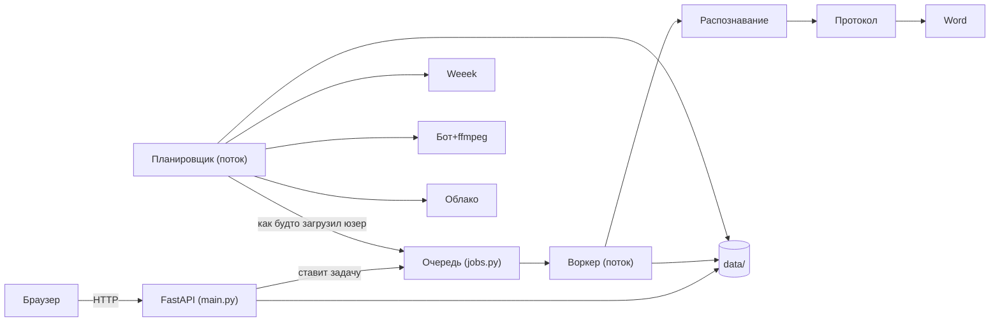

# 🖥 Бэкенд — очень понятно

Как устроен сервер изнутри: из каких «кирпичиков» собран, что происходит при каждом
запросе, как работает очередь задач, планировщик и бот, вся таблица API и как это
**разрабатывать и запускать**. Написано так, чтобы разобрался и новичок.

Архитектурный обзор и диаграммы потоков — в **[Архитектура](АРХИТЕКТУРА.md)** и
**[Диаграммы](ДИАГРАММЫ-UML-BPMN.md)**.

---

## 1. Общая идея за 30 секунд

Есть **веб-сервер** (FastAPI). Он принимает запросы от браузера. Тяжёлую работу
(распознавание, протокол) он **не делает сам** — он кладёт «задачу» в **очередь**,
а её выполняет отдельный **воркер** (фоновый поток), по одной задаче за раз. Рядом
живёт **планировщик** — ещё один фоновый поток, который сам ходит в Weeek, находит
встречи и запускает **бота** для записи. Всё состояние (задачи, настройки, записи)
лежит в папке `data/`.



Две «половины»: **ручной конвейер** (файл → текст → протокол) и **автоматизация**
(та же обработка, но вокруг живых встреч). Соединяются в одной точке: планировщик
кладёт запись в ту же очередь `jobs`, как будто её загрузил пользователь.

---

## 2. Жизненный цикл запроса (что происходит по шагам)

**Пример: пользователь загрузил файл для распознавания с протоколом.**

1. Браузер шлёт `POST /api/jobs` (файл + опции).
2. **Гейт авторизации** (`_auth_gate` в `main.py`) проверяет сессию-cookie. Нет
   сессии → `401`/редирект на `/login`.
3. Обработчик сохраняет файл в `data/uploads`, проверяет размер и формат.
4. Вызывает `store.create(...)` → создаётся объект **Job** (статус `queued`) и
   кладётся в `queue.Queue`. Пользователю сразу возвращается `job_id`.
5. **Воркер** (фоновый поток) забирает задачу, ставит `running`.
6. `transcribe_file(...)` гонит **faster-whisper**; сегменты появляются по одному —
   их видно в UI через `GET /api/jobs/{id}/partial` (опрос каждые 1.5 c).
7. Если включено — диаризация / **определение говорящего по видео** / OCR экрана.
8. Пишутся результаты (TXT/SRT/JSON) в `data/results`.
9. Если `analyze=true` — статус `analyzing`, `analyze_transcript(...)` собирает
   протокол (map-reduce), `generate_report(...)` пишет `.docx`.
10. Статус `done`. UI показывает ссылки на скачивание.

Пауза/отмена — **кооперативные**: воркер проверяет флаги между сегментами и
чанками (исключения `JobCancelled` / `AnalysisCancelled`).

---

## 3. Карта модулей (что за что отвечает)

### Ядро (`app/`)

| Файл | Ответственность |
|---|---|
| `main.py` | FastAPI: все эндпоинты, гейт авторизации, рендер `index.html`/`automation.html`/`login.html`, отдача React-SPA на `/app` (статика `/app/assets` + fallback на `index.html` для клиентского роутинга), старт планировщика. |
| `config.py` | Конфиг из переменных окружения, списки моделей/провайдеров, рантайм-ключи. |
| `jobs.py` | `JobStore`: очередь, один воркер, пауза/отмена, персист `jobs.json`, ретеншн, весь конвейер задачи. |
| `transcribe.py` | Обёртка над faster-whisper; модель кэшируется (одна за раз), перезагружается при смене. |
| `analyze.py` | Сборка протокола: схема JSON, промпт, **map-reduce** для длинных встреч, `AnalysisCancelled`. |
| `llm.py` | Абстракция LLM-провайдеров (Ollama/Groq/Gemini/Yandex/GigaChat/Anthropic), ретраи, **ротация ключей** при лимите. |
| `docx_export.py` | Рендер Word-протокола (`generate_report`). |
| `formats.py` | Экспорт сегментов в TXT/SRT/JSON (с метками спикеров). |
| `glossary.py` | Замены «как слышится → правильно» в тексте. |
| `diarize.py` | Диаризация по звуку (pyannote); `readiness()`. |
| `screen_ocr.py` | Сэмплинг кадров (PyAV) + OCR (Tesseract) текста с экрана. |
| `speaker_id.py` | **Определение говорящего по видео**: зелёная подсветка + OCR имени → метки сегментов. |
| `security.py` | Авторизация, сессии, хэш паролей, шифрование секретов под ключ пользователя, **одноразовые коды восстановления** (`generate_recovery_code`/`confirm_recovery_code`, хеш+TTL+лимит попыток в `recovery.json`). |
| `user_creds.py` | Пул API-ключей LLM пользователя (зашифрован). |
| `sms.py` | Отправка SMS для кода восстановления пароля. Провайдер по env: **SMS.ru** (`VTX_SMSRU_API_ID`) либо «console»-заглушка (код в лог) до настройки шлюза. |
| `db.py` | **PostgreSQL-бэкенд** (psycopg 3, пул соединений). Когда задан `DATABASE_URL`, вся структурированная информация (users/sessions/recovery/jobs/settings/creds/meetings/ai_context) хранится в БД вместо JSON-файлов; модули (`security`, `jobs`, `settings`, …) прозрачно вызывают его вместо файловых чтений/записей. Логика приложения не меняется. Схема нормализованная (JSONB — только для реально документных полей: `jobs.analysis`/участники/движки и bag настроек). Пустой `DATABASE_URL` = файловый бэкенд (тесты/локалка). Медиа-файлы всегда на диске/в облаке. |
| `autosetup.py` | **Авто-настройка при первом запуске**: в фоне доустанавливает OCR-движок, ffmpeg, Chromium бота и скачивает все модели речи. `VTX_AUTO_SETUP=0` отключает. |
| `ollama_setup.py`, `whisper_setup.py`, `deps_setup.py` | Установка/подготовка зависимостей и моделей (`whisper_setup.preload_all`, `deps_setup._apt_install`). |

### Автоматизация (`app/automation/`)

| Файл | Ответственность |
|---|---|
| `scheduler.py` | Демон-цикл: опрос Weeek, состояния встреч (`MeetingState`), запуск/стоп записи, конвейер, форс-опрос. |
| `weeek.py` | Клиент Weeek: находит встречи (ссылка + время), читает кастом-поля (в т.ч. булеву «Запись встречи»), пишет ссылки/комментарии. |
| `settings.py` | Постоянные настройки/токены на диске (`automation.json`, 0600, секреты зашифрованы). |
| `recorder/__init__.py` | Оркестратор записи: **слоты** параллелизма, `record_meeting(...)`. |
| `recorder/browser.py` | Заход в Телемост через Playwright/Chromium (гость/профиль), списки селекторов. |
| `recorder/capture.py` | Захват экрана+звука через ffmpeg (x11grab + PulseAudio). |
| `clouds/` | Выгрузка: `yandex_disk.py`, `gdrive.py`, `local.py` + общий диспетчер `upload()`/`readiness()`. |

---

## 4. Очередь задач — `jobs.py` (сердце ядра)

- **`JobStore`** держит все задачи, `queue.Queue` и запускает при старте два потока:
  **воркер** (выполняет задачи) и **очиститель** (ретеншн старых результатов).
- **Почему один воркер?** ASR и LLM тяжёлые; на одном CPU параллелить смысла нет —
  так память предсказуема, а поведение простое.
- **`Job`** (dataclass) — вся задача: `id`, `owner`, `filename`, `status`,
  `progress`, опции (`analyze`, `diarize`, `capture_screen`, `identify_speakers`,
  `provider`, `model`, …) и результаты (`analysis`, `docx_providers`, ошибки).
- **Пауза/отмена** — через словарь флагов `_control[job_id]`, читаемый в колбэках.
- **Персист** — `data/jobs.json`. При рестарте незавершённые задачи помечаются
  прерванными; задачи «на анализе» оставляют текст и предлагают «Повторить анализ».
- **Изоляция** — каждый per-job эндпоинт проверяет `job.owner == текущий_логин`.

Главный метод конвейера (упрощённо): `transcribe → (diarize?) → (speaker_id?) →
форматы → (screen_ocr?) → (analyze? → docx)` — ровно в этом порядке, всё
best-effort: сбой опции не ломает распознавание.

---

## 5. Распознавание — `transcribe.py`

- Одна модель **faster-whisper** в памяти (кэш), перезагружается при смене размера.
- `transcribe_file(...)` возвращает список **`Segment`** (`start`, `end`, `text`,
  `speaker`) и метаданные. Колбэк `on_segment` отдаёт сегменты по мере готовности —
  отсюда «живой» текст в UI.
- Видео поддерживается напрямую (звук извлекается через PyAV/ffmpeg).

---

## 6. Протокол — `analyze.py` + `llm.py`

**`analyze.py`:**
- Короткий текст → один проход; длинный (> порога) → **map-reduce**: режем на части
  с перекрытием, делаем заметки по каждой, потом сводим в единый протокол —
  ничего не теряется.
- **Схема протокола** (JSON): участники, summary, подробные темы, ключевые мысли,
  выводы, решения, выполненные задачи, задачи+ответственные, мелкие задачи.
- **Правила промпта:** писать простым языком «для того, кого не было»; темы
  самодостаточны (10–12 предложений); **ответственных не угадывать** (owner только
  при явном «я возьму»/поручении по имени); метки-имена из видео считаются
  достоверным автором.

**`llm.py`:**
- Единый интерфейс `complete(...)` для всех провайдеров.
- **`_RotatingProvider`**: если у пользователя несколько ключей — при ошибке лимита
  (429) сам переключается на следующий; если все исчерпаны — понятная ошибка.
- `get_provider(name, keys)` строит нужный провайдер (локальный Ollama стримит
  токены — отсюда живой протокол в UI).

---

## 7. Кто говорил — `speaker_id.py` (ключевая фича)

Расшифровка звука **не знает**, кто говорит. Поэтому имя берётся **с видео**:

1. Сэмплируем кадры (PyAV, ~каждые 1.5 c).
2. Находим **зелёную рамку активного участника** (numpy-маска цвета + проверка,
   что это именно рамка-прямоугольник вокруг плитки, а не зелёная одежда/фон).
3. **OCR** имени в подписи плитки (Tesseract, рус+англ).
4. Строим таймлайн «кто-когда» и подписываем каждый сегмент по перекрытию времени —
   в то же поле `Segment.speaker`, что и диаризация.

Пороги настраиваются через `VTX_SPEAKER_*`; `debug_report()` помогает
откалибровать цвет по реальной записи. Всё best-effort: не распозналось — текст
просто без имён, распознавание не ломается.

---

## 8. Планировщик — `scheduler.py` (сердце автоматизации)

- Отдельный **демон-поток** `_loop`. Для **каждого** пользователя под его токенами:
  раз в `poll_interval_sec` вызывает `_poll(...)` (опрос Weeek) и на каждом тике —
  `_maybe_trigger(...)` (пора ли писать).
- **`MeetingState`** — встреча и её статус (`scheduled/recording/uploading/
  transcribing/analyzing/done/missed/skipped/error`), плюс `record_flag` (галочка
  Weeek) и `job_id`.
- **`_passes_filter(...)`** решает, писать ли: ручной выбор > **галочка Weeek
  «Запись встречи»** > режим по умолчанию + фильтры (слова/время/дни).
- **`_maybe_trigger(...)`**: в окне `[start − lookahead, start + grace]` берёт
  свободный **слот** и запускает `_run(...)` в коротком потоке. Прошедшие до старта
  сервиса встречи → `missed` (защита от «догона»).
- **`_run(...)`**: запись → облако → создание задачи в `jobs.store` (флаги
  распознавания/протокола/OCR/спикеров) → комментарий в Weeek. Живой статус после
  записи берётся из состояния самой задачи (`_enrich_from_job`).
- **`poll_now(user)`** — принудительный опрос (кнопка «Обновить статус»).
- **`status(user)`** — то, что видит UI: список встреч с живыми статусами.

---

## 9. Бот и захват — `recorder/`

- **Слоты параллелизма** (`acquire_slot`/`release_slot`): до
  `VTX_MAX_CONCURRENT_RECORDINGS` записей одновременно, каждая — свой виртуальный
  экран (Xvfb `:99…`) и свой аудио-синк PulseAudio (`meet0…`). Изоляция полная.
- **`browser.py`**: Playwright/Chromium заходит в Телемост гостем (микрофон/камера
  выкл., тихий фейк-мик), окно развёрнуто на весь виртуальный экран. Списки
  селекторов-кандидатов на случай смены вёрстки; скриншот при неудаче.
- **`capture.py`**: ffmpeg пишет `x11grab` (экран этого дисплея) + `pulse`
  (монитор этого синка). Стоп — по `threading.Event`.
- **`record_meeting(...)`**: эксклюзивность на уровне машины (in-process `Lock` +
  PID-файл `data/recorder.lock`) — бот не зайдёт дважды; протухший лок снимается.

---

## 10. Weeek — `weeek.py`

- Только `urllib` (без тяжёлых SDK) + ретраи с бэкофом и `Connection: close`
  (Weeek иногда обрывает большой ответ — это молча ломало опрос).
- `upcoming_meetings(...)` → список `Meeting` (task_id, title, url, start,
  project_id, raw). Ссылка на Телемост ищется в кастом-полях (сначала link-поля),
  описании, названии. Время старта — из нескольких кандидатов полей (важно брать
  **начало**, а не конец диапазона).
- `custom_field_bool(task, name)` — читает булеву галочку (напр. «Запись встречи»),
  терпима к разным форматам значения.
- Запись: `set_custom_field(...)` (ссылки в поля, формат `{fieldId: "строка"}`),
  `add_comment(...)`.

---

## 11. Облака — `clouds/`

- Единый `upload(file, name, settings, backend=None, folder=None)` и `readiness()`.
- Реализации: `yandex_disk.py` (REST по токену), `gdrive.py` (REST OAuth2),
  `local.py` (копирование в папку). Всё на stdlib `urllib`.
- Протоколы уходят в **отдельную** папку (не туда, где видео).

---

## 12. Безопасность — `security.py`

- **Пароли:** PBKDF2-HMAC-SHA256 (200 000 итераций, своя соль), сравнение
  постоянное по времени.
- **Сессии:** `secrets.token_urlsafe(32)` в cookie `vtx_session` (HttpOnly,
  SameSite=Lax, Secure при `VTX_HTTPS=1`), срок `VTX_SESSION_TTL_HOURS`.
- **Секреты:** Fernet/AES; master-key (`VTX_SECRET_KEY` или `data/secret.key`), из
  него через HKDF — **отдельный ключ на каждый логин**. Чужой логин чужие секреты
  не расшифрует.
- **Изоляция:** данные/токены в `data/users/<логин>/…`; каждый per-job эндпоинт
  проверяет владельца.

Подробнее — **[Безопасность](БЕЗОПАСНОСТЬ.md)**.

---

## 13. Полная таблица API

> Всё под гейтом авторизации, кроме `/login`, `/register`, `/recover`, `/healthz`
> и публичных auth-API (`login`, `register`, `recover/request`, `recover/verify`).

### Аутентификация и страницы
| Метод | Путь | Назначение |
|---|---|---|
| GET | `/login`, `/register`, `/recover` | HTML входа/регистрации/восстановления |
| POST | `/api/auth/register` | регистрация (первый = админ, далее — по коду) |
| POST | `/api/auth/login` | вход, выдача сессии-cookie |
| POST | `/api/auth/logout` | выход |
| GET | `/api/auth/me` | кто я |
| POST | `/api/auth/recover/request` | шаг 1 восстановления — отправить SMS-код на телефон |
| POST | `/api/auth/recover/verify` | шаг 2 — проверить код, задать новый пароль, отозвать сессии |
| GET | `/api/profile` | профиль (логин, маска телефона, роль) |
| POST | `/api/profile/phone` | сменить телефон (нужен текущий пароль) |
| POST | `/api/profile/password` | сменить пароль (по старому паролю ИЛИ телефону) |
| GET | `/` | главная (распознавание + протокол, Jinja) |
| GET | `/automation` | страница автоматизации (Jinja) |
| GET | `/app`, `/app/{путь}` | React-SPA «MeetFlowAI» (весь UI; статика на `/app/assets`) |
| GET | `/healthz` | health-check |

### Задачи распознавания
| Метод | Путь | Назначение |
|---|---|---|
| POST | `/api/jobs` | создать задачу (файл + опции) |
| GET | `/api/jobs` | список моих задач |
| GET | `/api/jobs/{id}` | статус задачи |
| GET | `/api/jobs/{id}/partial` | живой текст/прогресс |
| GET | `/api/jobs/{id}/result` | скачать TXT/SRT/JSON/DOCX/screen |
| POST | `/api/jobs/{id}/pause` · `/resume` · `/cancel` | управление задачей |
| POST | `/api/jobs/{id}/reanalyze` | пере-собрать протокол другим движком |

### Провайдеры LLM
| Метод | Путь | Назначение |
|---|---|---|
| GET | `/api/providers` | доступные движки + мои ключи |
| POST | `/api/providers/connect` · `/disconnect` | добавить/убрать ключ |
| GET | `/api/prompt/default` | дефолтный промпт (экспертный режим) |

### Готовность/установка компонентов
| Метод | Путь | Назначение |
|---|---|---|
| GET | `/api/diarization/status` · POST `/api/diarization/token` | диаризация |
| GET | `/api/screen/status` | OCR экрана |
| GET | `/api/speakers/status` | определение говорящего по видео |
| GET | `/api/ollama/status` · POST `/api/ollama/install` · `/install/cancel` | локальный движок |
| GET | `/api/setup/deps` · POST `/api/setup/deps/{component}/install` | доустановка зависимостей |
| GET | `/api/model/status` · POST `/api/model/download` | модели распознавания |

### Автоматизация
| Метод | Путь | Назначение |
|---|---|---|
| GET/POST | `/api/automation/settings` | чтение/сохранение настроек автоматики |
| GET | `/api/automation/meetings` | ближайшие встречи из Weeek (пикер) |
| POST | `/api/automation/meetings/{task_id}/decision` | писать/не писать конкретную встречу |
| GET | `/api/automation/clouds/status` · POST `/clouds/test` | облако: готовность/тест |
| GET | `/api/automation/scheduler/status` | статус планировщика + встречи |
| POST | `/api/automation/scheduler/run-now` | записать встречу сейчас |
| POST | `/api/automation/scheduler/poll-now` | принудительный опрос Weeek |
| POST | `/api/automation/scheduler/stop-recording` | остановить запись |
| GET | `/api/automation/recorder/*` | статус/устройства/логин/тест бота |
| POST | `/api/automation/recorder/login` · `/test` | вход в профиль / тест захвата |
| GET | `/api/automation/weeek/projects` · `/weeek/probe` | проекты / диагностика задачи |

---

## 14. Данные на диске (`data/`)

| Что | Где | Переживает рестарт |
|---|---|---|
| Загрузки/результаты | `data/uploads`, `data/results` | да (до ретеншна) |
| Метаданные задач | `data/jobs.json` | да |
| Записи встреч | `data/recordings` или облако | да |
| Пользователи/сессии | `data/users.json`, `data/sessions.json` | да |
| Коды восстановления пароля | `data/recovery.json` (хеш кода + TTL + попытки) | да (но код живёт минуты) |
| Настройки/токены автоматики | `data/users/<логин>/automation.json` (0600) | **да** |
| Master-key шифрования | `VTX_SECRET_KEY` или `data/secret.key` | да |
| Лок записи | `data/recorder.lock` (PID) | снимается по живому PID |
| Живой прогресс/стрим | в памяти | нет |

**PostgreSQL-бэкенд.** Если задан `DATABASE_URL`, всё из таблицы выше, КРОМЕ
файлов (загрузки/результаты/записи) и `secret.key`, переезжает в Postgres
(таблицы `users`, `sessions`, `recovery_codes`, `jobs`, `user_settings`,
`user_creds`, `meetings`, `ai_context(+_projects)` — см. `app/db.py`). Секреты
по-прежнему **зашифрованы** (в БД лежит тот же шифртекст, мастер-ключ —
`VTX_SECRET_KEY`). `docker-compose` поднимает сервис `db` (данные в
`./data/postgres`). Разовый перенос файлов в БД: `python -m
scripts.migrate_to_postgres` (идемпотентно; медиа не трогает).

---

## 15. Ключевые переменные окружения (`config.py`)

| Переменная | Смысл |
|---|---|
| `VTX_DATA_DIR` | папка данных (в Docker `/data`) |
| `VTX_MODEL`, `VTX_COMPUTE_TYPE`, `VTX_CPU_THREADS`, `VTX_BEAM_SIZE` | параметры распознавания (по умолчанию `large-v3-turbo`) |
| `VTX_AUTO_SETUP`, `VTX_PRELOAD_MODELS` | авто-установка зависимостей и предзагрузка всех моделей при старте (по умолч. вкл.) |
| `VTX_SECRET_KEY` | master-key шифрования секретов |
| `VTX_HTTPS`, `VTX_SESSION_TTL_HOURS`, `VTX_REGISTRATION_CODE` | безопасность/сессии/регистрация |
| `DATABASE_URL`, `POSTGRES_USER/PASSWORD/DB` | PostgreSQL-бэкенд (пусто → файловое хранилище) |
| `VTX_SMSRU_API_ID`, `VTX_SMSRU_FROM`, `VTX_SMSRU_TEST`, `VTX_SMS_PROVIDER` | SMS-шлюз для кода восстановления пароля (пусто → «console»-заглушка) |
| `VTX_RECOVERY_CODE_TTL_SEC`, `VTX_RECOVERY_MAX_ATTEMPTS`, `VTX_RECOVERY_RESEND_SEC` | срок жизни кода, лимит попыток, антиспам-пауза повторной отправки |
| `VTX_RECORDER_ENABLED` | включить бота-рекордера |
| `VTX_MAX_CONCURRENT_RECORDINGS`, `VTX_DISPLAY_BASE`, `VTX_SCREEN_RES` | параллельная запись/дисплеи |
| `VTX_SPEAKER_*` | калибровка распознавания говорящего по видео |
| `VTX_DIARIZATION`, `HF_TOKEN` | диаризация |
| `OLLAMA_URL`, `VTX_OLLAMA_MODEL` | локальный LLM |
| `ANTHROPIC_API_KEY`, `GROQ_API_KEY`, `GEMINI_API_KEY`, `YANDEX_*`, `GIGACHAT_*` | серверные ключи провайдеров (фолбэк) |

---

## 16. Как это разрабатывать и запускать

### Запуск (Docker — рекомендуется)
```bash
# из корня репозитория
docker compose up -d --build          # собрать и поднять
curl -s http://localhost:8000/healthz # проверка (ожидаем 200)
# первый вход на / — регистрируем администратора
```

### Локальная разработка Python (без Docker)
```bash
python3.12 -m venv .venv && source .venv/bin/activate
pip install -r requirements.txt
uvicorn app.main:app --reload --port 8000
```
Для бота дополнительно нужны системные пакеты (см. `Dockerfile`): `ffmpeg`,
`tesseract-ocr(+rus)`, `xvfb`, `pulseaudio`, Chromium через `playwright install`.

### Тесты
```bash
python -m pytest tests/            # напр. tests/test_auth_security.py (33 кейса)
```

### Куда смотреть, чтобы что-то добавить
- **Новый LLM-движок** → класс-провайдер в `llm.py` + регистрация в `config.py`.
- **Новое облако** → модуль в `clouds/` с `readiness()`/`upload()` + запись в диспетчер.
- **Другой захват A/V** → за интерфейсом `capture`.
- **Другой трекер вместо Weeek** → клиент по образцу `weeek.py`, отдающий `Meeting`.
- **Правки распознавания говорящего** → пороги `VTX_SPEAKER_*` и `speaker_id.py`.
- **Селекторы Телемоста** → списки-кандидаты в `recorder/browser.py`.

### Полезные заметки
- Пины версий (`ctranslate2==4.4.0`, Python 3.12, база `bookworm`) — **не трогать
  без причины**: новые версии ломали распознавание/загрузчик.
- Всё, что уходит наружу (облако, облачный LLM), — только по явному выбору
  пользователя. Локальность — принцип по умолчанию.
