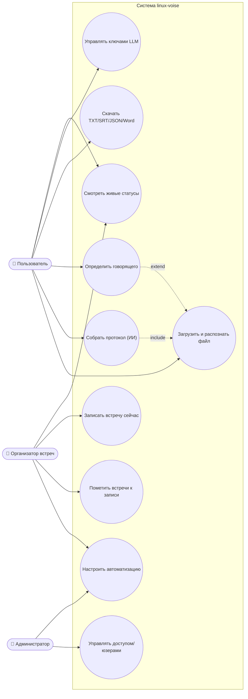
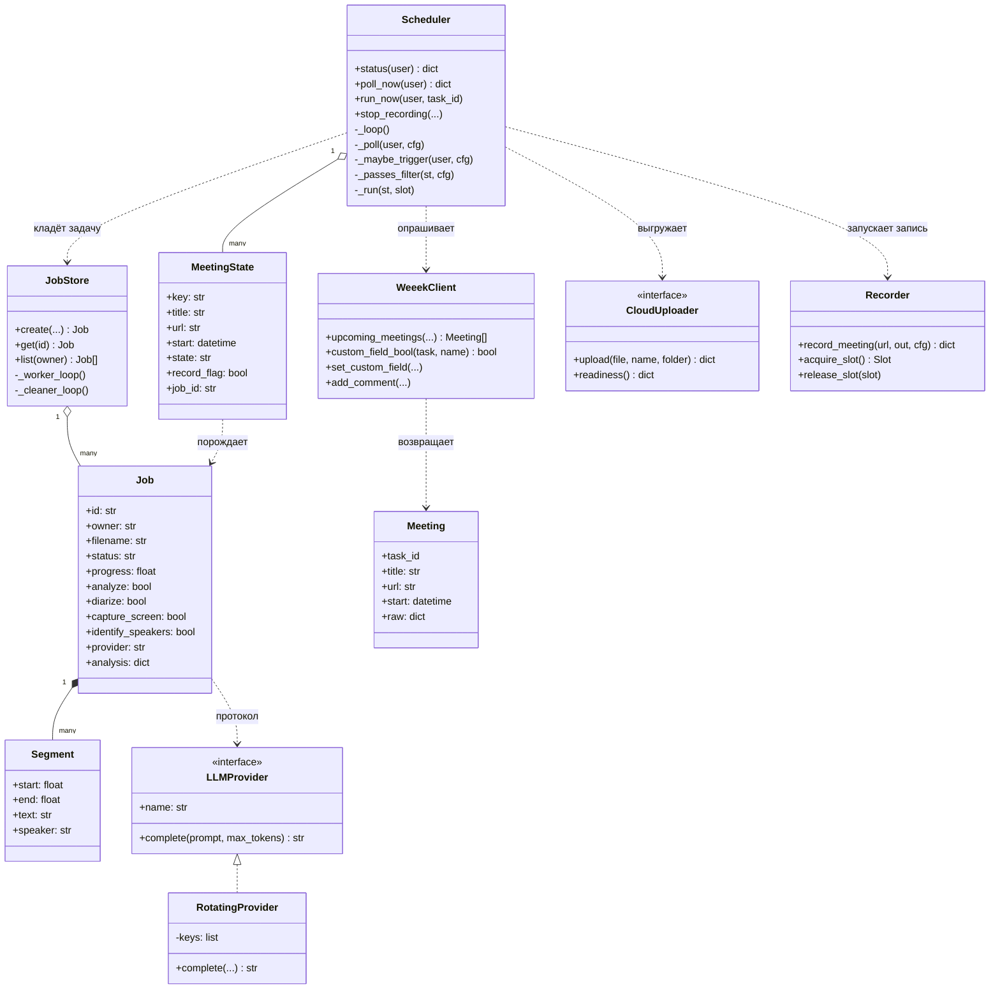
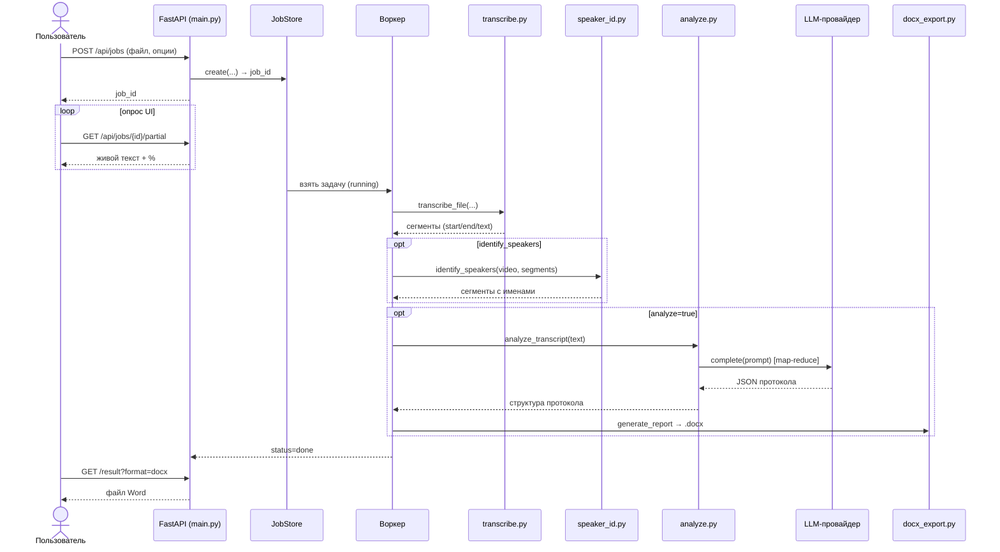
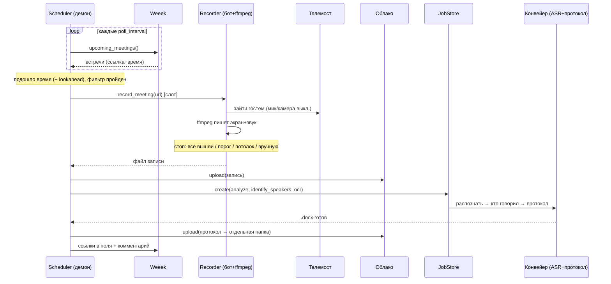
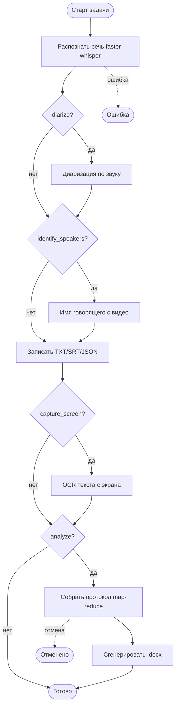
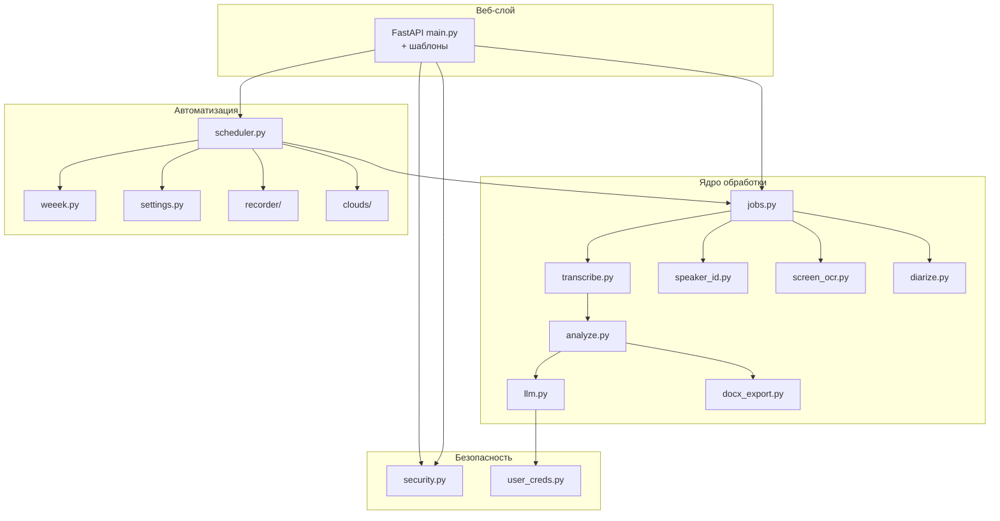
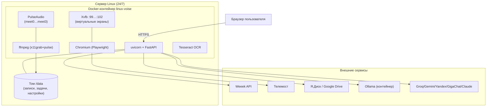
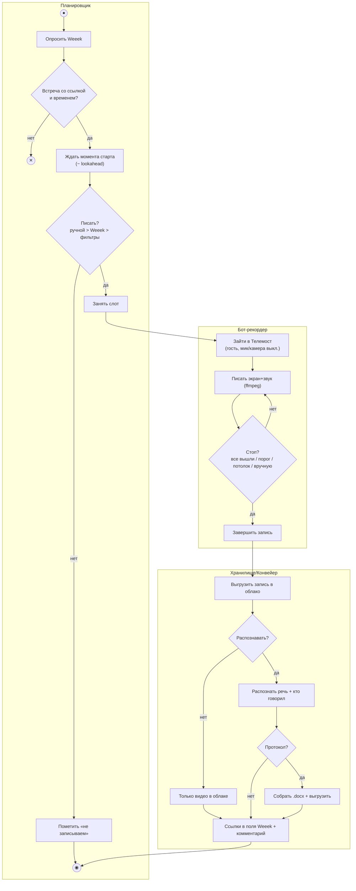
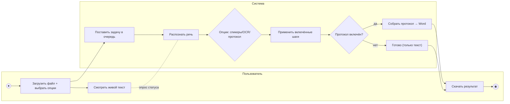
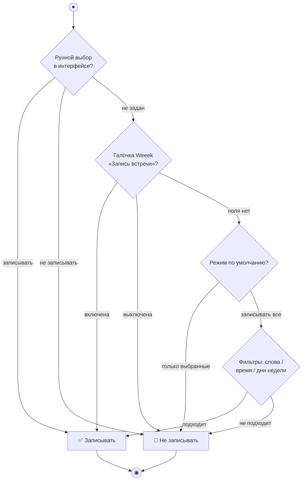

# 📊 Диаграммы: UML и BPMN

Все диаграммы — на языке **Mermaid**, они отрисовываются прямо на GitHub. Здесь
собраны: варианты использования (Use Case), классы, последовательности,
активности, состояния, компоненты, развёртывание, а также бизнес-процессы в стиле
**BPMN**.

Смежные документы: **[Системный анализ](СИСТЕМНЫЙ-АНАЛИЗ.md)** (ER-диаграмма,
состояния), **[Бэкенд](БЕКЕНД.md)**, **[Архитектура](АРХИТЕКТУРА.md)**.

---

## 1. UML: Use Case (варианты использования)

Кто и что делает с системой.



---

## 2. UML: диаграмма классов (основные объекты бэкенда)



---

## 3. UML: последовательность — ручное распознавание + протокол



---

## 4. UML: последовательность — автозапись встречи (без человека)



---

## 5. UML: диаграмма активности — конвейер задачи



---

## 6. UML: состояния (жизненные циклы)

Диаграммы состояний **Job** и **MeetingState** приведены в
**[Системном анализе, раздел 5](СИСТЕМНЫЙ-АНАЛИЗ.md#5-состояния-ключевых-объектов)**.
Кратко напоминание для встречи:

```mermaid
stateDiagram-v2
  [*] --> scheduled
  scheduled --> skipped : фильтр/галочка Weeek «нет»
  scheduled --> recording : пора писать
  recording --> uploading --> transcribing --> analyzing --> done
  scheduled --> missed
  done --> [*]
```

---

## 7. UML: компонентная диаграмма



---

## 8. UML: диаграмма развёртывания (deployment)



---

## 9. BPMN: процесс «Автоматическая обработка встречи»

BPMN-нотация: **дорожки** (lanes) = участники процесса; прямоугольники = задачи;
ромбы = развилки (gateways); кружки = события начала/конца.



---

## 10. BPMN: процесс «Ручное распознавание и протокол»



---

## 11. BPMN: принятие решения «записывать встречу или нет»



---

## 12. Как поддерживать диаграммы в актуальности

- Диаграммы — **текст** (Mermaid), поэтому правятся как код и версионируются в git.
- При изменении процесса/классов правьте соответствующий блок здесь и, если нужно,
  в **[Архитектуре](АРХИТЕКТУРА.md)** (там — потоки данных верхнего уровня).
- Источник правды — код в `app/`; диаграммы должны ему соответствовать.
