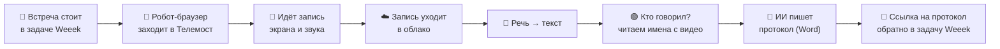

# 👵 Как это работает — простыми словами

Этот документ объясняет проект так, чтобы понял **любой человек**: и бабушка, и
новый разработчик, который открыл проект впервые. Без сложных слов. Где термин
всё-таки нужен — рядом сразу простое объяснение.

---

## 1. Представьте обычную рабочую встречу

Люди созвонились в **Телемосте** (это как Zoom, только от Яндекса), полчаса
что-то обсуждали, о чём-то договорились, кому-то что-то поручили. И вот встреча
закончилась. Что обычно происходит дальше?

- Кто-то должен **вспомнить**, о чём говорили.
- Кто-то должен **записать**, какие приняли решения.
- Кто-то должен **не забыть**, кому какие задачи поручили.

Обычно это делают руками. Это скучно, долго, и половина забывается.

**Наш сервис делает всё это сам.**

---

## 2. Что делает сервис — история на пальцах

> 🗣️ Аналогия: представьте очень внимательного и быстрого **секретаря**, который
> сидит на каждой встрече, всё записывает, а потом за минуту оформляет красивый
> протокол и раскладывает его по папкам. Только это не человек, а программа.

Вот что «секретарь» умеет:

1. **Слушает и записывает речь.** Берёт аудио или видео встречи и превращает
   голос в **текст** — дословно, со временем каждой фразы.
   *(Умное слово: «распознавание речи», по-английски ASR.)*

2. **Понимает, кто говорил.** Смотрит на видео встречи: в Телемосте говорящий
   подсвечивается зелёной рамкой, а рядом написано его имя. Программа
   «читает» имя прямо с картинки и подписывает реплики — **без путаницы**.

3. **Пишет протокол.** Отдаёт весь текст «искусственному интеллекту» (это как
   очень начитанный помощник), и тот составляет короткий понятный документ:
   о чём была встреча, какие решения приняли, какие задачи поставили и **кто за
   что отвечает**. Готовый документ — в формате **Word**.

4. **Может всё сделать сам, без человека.** Если подключить трекер задач
   **Weeek** (это программа, где команда ведёт список дел и встреч), сервис сам:
   заходит на встречу вместо вас «роботом», записывает её, распознаёт, пишет
   протокол и кладёт ссылку обратно в задачу. Вы приходите — а всё уже готово.

---

## 3. Как «робот» попадает на встречу

У Телемоста нет «служебного входа» для программ. Поэтому сервис использует
**обычный браузер** (как Chrome), который сам открывает ссылку на встречу и
заходит туда **гостем с выключенными микрофоном и камерой** — как тихий участник,
который просто слушает. А запись экрана и звука делает отдельная программа
(**ffmpeg** — «видеомагнитофон» для компьютера).

> 🤖 Проще говоря: сервис сажает на встречу «робота-невидимку», который молча
> сидит в уголке и всё записывает.

Чтобы это работало на сервере (где нет монитора), создаётся **виртуальный экран**
(Xvfb — «понарошку монитор») и **виртуальный микрофон/динамик** (PulseAudio),
чтобы браузеру было куда «показывать» и откуда «слышать».

---

## 4. Где всё это живёт

Программа упакована в **Docker** — это как коробка, в которую сложили всё
необходимое (саму программу и все её «инструменты»), чтобы она одинаково
запускалась на любом компьютере одной командой. Не нужно ничего долго
устанавливать вручную.

Запускается на сервере, который работает **круглосуточно**, чтобы встречи
записывались, даже когда вы спите.

---

## 5. Приватно ли это?

Да. Вход — только по **логину и паролю**. У каждого пользователя свои данные, и
чужой их не увидит. Секретные ключи (например, доступ к Weeek или облаку)
**зашифрованы**. По умолчанию **всё считается на вашем сервере** и никуда не
уходит. Наружу отправляется только то, что вы сами разрешили: например, если
выбрали хранить записи в облаке или пользоваться «облачным» искусственным
интеллектом.

---

## 6. Весь путь встречи — одной картинкой

---

## 7. Мини-словарь (простыми словами)

| Слово | Что значит по-простому |
|---|---|
| **Распознавание речи (ASR)** | превращение голоса в текст |
| **Протокол** | короткий документ с итогами встречи: решения, задачи, кто отвечает |
| **LLM / ИИ** | «начитанный помощник», который читает текст и пишет протокол |
| **Телемост** | сервис видеозвонков от Яндекса (как Zoom) |
| **Weeek** | программа для списка задач и встреч команды |
| **Бот-рекордер** | «робот»-браузер, который заходит на встречу и записывает её |
| **Docker** | «коробка» с программой, запускается одной командой везде одинаково |
| **Облако** | хранилище файлов в интернете (Яндекс.Диск, Google Drive) |
| **Xvfb** | «понарошку монитор» для сервера без экрана |
| **PulseAudio** | «понарошку звуковая карта» для сервера без колонок |
| **ffmpeg** | «видеомагнитофон» — записывает экран и звук |
| **Диаризация** | разделение записи на «кто из говорящих сейчас говорит» |
| **OCR** | «чтение текста с картинки» (например, со слайда на экране) |

---

## 8. А как это устроено внутри (для будущего разработчика)

Если вы разработчик и вам нужно это **дорабатывать**, дальше читайте:

- **[Бэкенд — очень понятно](БЕКЕНД.md)** — сервер по кусочкам, как устроен код.
- **[Архитектура](АРХИТЕКТУРА.md)** — из чего собрано и почему.
- **[Диаграммы UML и BPMN](ДИАГРАММЫ-UML-BPMN.md)** — визуальные схемы.
- **[Системный анализ](СИСТЕМНЫЙ-АНАЛИЗ.md)** — требования и сущности.

А если нужно просто **пользоваться** — читайте **[Руководство](РУКОВОДСТВО.md)**.
