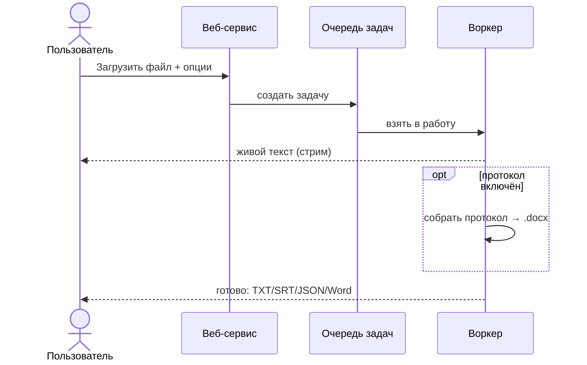
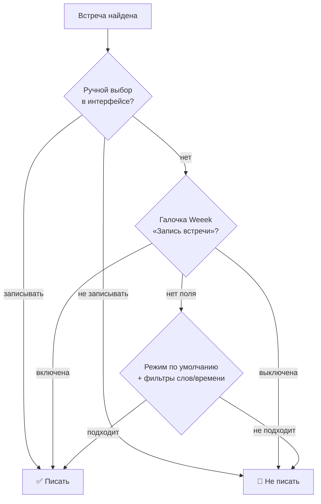
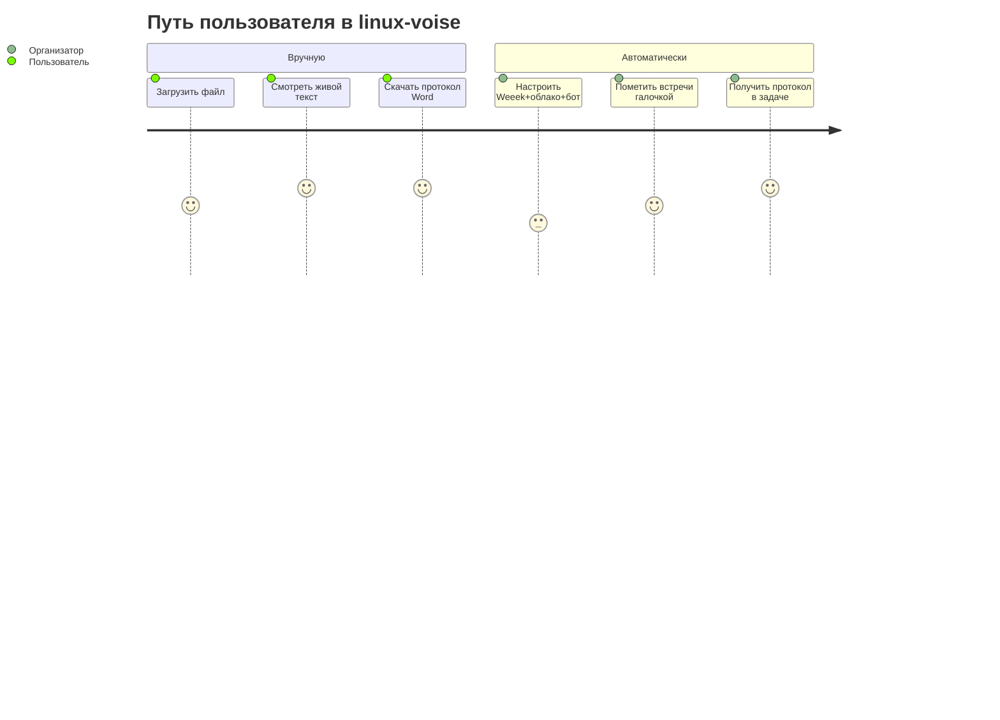

# 🚶 Пользовательские сценарии

Пошаговые истории «как человек этим пользуется». Каждый сценарий: **кто**, **зачем**,
**шаги**, **что на выходе** и **что если пойдёт не так**. Сценарии написаны просто —
как инструкция, понятная любому.

Связано: **[Функционал](ФУНКЦИОНАЛ.md)**, **[Руководство](РУКОВОДСТВО.md)**,
**[Диаграммы](ДИАГРАММЫ-UML-BPMN.md)**.

---

## Сценарий 1. Распознать запись и получить протокол (вручную)

**Кто:** пользователь. **Зачем:** есть файл встречи — нужен текст и протокол.

1. Войти на сайт (логин/пароль).
2. На главной странице выбрать файл (аудио или видео) и нажать загрузить.
3. При желании включить опции: модель точнее, подсказку имён/терминов, глоссарий,
   «собрать протокол», «определять говорящего по видео», «OCR экрана».
4. Наблюдать, как **текст появляется в реальном времени**.
5. Когда готово — скачать **TXT/SRT/JSON**, а если включён протокол — **Word (.docx)**.

**На выходе:** текст встречи + структурированный протокол с решениями, задачами и
ответственными.

**Если пойдёт не так:**
- *Формат файла не поддержан* → загрузите mp4/mkv/mp3/wav и т.п.
- *Нет движка протокола* → включите Ollama или добавьте ключ провайдера.
- *Долго* → выберите модель полегче или отключите тяжёлые опции.

---

## Сценарий 2. Подключить свой ИИ-движок и ключи

**Кто:** пользователь. **Зачем:** пользоваться конкретным LLM (напр. Groq/Claude).

1. Открыть настройки провайдеров в аккаунте.
2. Выбрать провайдера, вставить API-ключ (для Yandex — ещё folder id).
3. При желании добавить **несколько ключей** (кнопка «Добавить ключ»).
4. Выбрать тариф модели (быстрее/сильнее).

**На выходе:** протоколы собираются выбранным движком; ключи хранятся
зашифрованными в аккаунте.

**Если пойдёт не так:**
- *Лимит исчерпан (429)* → добавьте второй ключ: сервис **сам переключится** на
  него и не прервёт генерацию.
- *Ключ неверный* → проверьте его в консоли провайдера.

---

## Сценарий 3. Настроить автозапись встреч (разовая настройка)

**Кто:** организатор встреч/администратор. **Зачем:** чтобы встречи писались сами.

1. Вкладка **«1 · Weeek»**: вставить токен Weeek, при желании выбрать проект и TZ.
2. Вкладка **«2 · Облако»**: выбрать облако (Я.Диск/Google Drive/локально) и доступы.
3. Вкладка **«3 · Бот-рекордер»**: проверить готовность (браузер, захват, звук).
4. Вкладка **«4 · Планировщик»**: включить автоматику, задать интервал опроса и
   «за сколько минут заходить»; выбрать, что делать после записи (распознать,
   протокол, OCR, определять говорящего); настроить, **какие встречи писать**.

**На выходе:** сервис сам находит встречи и пишет их по расписанию.

**Если пойдёт не так:**
- *Weeek не отдаёт встречи* → проверьте токен/проект, нажмите «Обновить статус».
- *Бот не готов* → доустановите зависимости по подсказкам готовности.

---

## Сценарий 4. Пометить встречу «писать / не писать» галочкой в Weeek

**Кто:** организатор. **Зачем:** решать по каждой встрече прямо в трекере.

1. В настройках планировщика включить «Управлять записью галочкой в Weeek» и
   указать имя чекбокс-поля (по умолчанию **«Запись встречи»**).
2. В задаче Weeek у нужной встречи **включить** галочку «Запись встречи» — бот
   запишет; **выключить** — бот не зайдёт.

**На выходе:** запись управляется прямо из Weeek; в списке встреч видно
«Weeek: запись вкл/выкл».

**Правило приоритета:** ручной выбор в интерфейсе > галочка Weeek > режим/фильтры.

---

## Сценарий 5. Автоматическая жизнь встречи (без человека)

**Кто:** планировщик (сам). **Зачем:** превратить встречу в протокол «под ключ».

1. Планировщик находит встречу в Weeek (ссылка + время).
2. За несколько минут до старта бот заходит в Телемост.
3. ffmpeg пишет экран+звук, пока в комнате есть люди.
4. Запись завершается (все вышли / стоп / потолок), файл уходит в облако.
5. Запускается конвейер: распознавание → «кто говорил» по видео → протокол.
6. Протокол (.docx) уходит в отдельную папку облака, ссылки — в поля Weeek,
   комментарий со ссылкой на запись — в задачу.

**На выходе:** к утру в задаче Weeek — ссылки на запись и готовый протокол.

**Если пойдёт не так:**
- *Телемост требует вход/капчу* → бот сохранит скриншот и лог; можно залить файл
  вручную (ручной фолбэк).
- *Встреча уже прошла (после рестарта)* → бот в неё не зайдёт (защита от «догона»).

---

## Сценарий 6. Записать встречу «прямо сейчас»

**Кто:** организатор. **Зачем:** срочно записать идущую встречу.

1. На странице автоматизации нажать «Показать ближайшие встречи» (или дождаться
   автозагрузки списка).
2. У нужной встречи нажать **«Записать сейчас» / «Сейчас»**.

**На выходе:** бот заходит и пишет немедленно, дальше — обычный конвейер.

---

## Сценарий 7. Следить за ходом обработки в реальном времени

**Кто:** любой пользователь. **Зачем:** видеть, на каком этапе встреча/задача.

1. Открыть страницу (главную или автоматизации).
2. Списки **обновляются сами**, без перезагрузки: статусы меняются
   `идёт запись → распознавание видео → генерация протокола → готово`.
3. На вкладке «Планировщик» — отдельная секция «📅 Сегодня»; полный список свёрнут.
4. Кнопка «Обновить статус» делает **немедленный** опрос Weeek.

**На выходе:** всегда виден актуальный статус без ручного обновления страницы.

---

## Сценарий 8. Остановить запись вручную

**Кто:** организатор. **Зачем:** прекратить запись досрочно.

1. На странице автоматизации нажать **«Остановить запись»** (или «Стоп» у
   конкретной встречи).

**На выходе:** запись корректно завершается, файл уходит в конвейер как обычно.

---

## Сценарий 9. Первый запуск и вход (администратор)

**Кто:** администратор. **Зачем:** развернуть сервис.

1. Развернуть через Docker Compose (одна команда) на сервере.
2. Открыть сайт, **зарегистрировать первого пользователя** — он становится
   администратором (без кода регистрации).
3. Задать окружение (`VTX_*`): секретный ключ, включение бота, лимит параллельных
   записей и т.п.
4. Пригласить остальных по коду регистрации.

**На выходе:** приватный сервис с изоляцией пользователей, готовый к работе 24/7.

**Если пойдёт не так:**
- *Распознавание не грузится* → проверьте базовый образ (`bookworm`) и версии.
- *Бот не пишет на сервере* → нужны Xvfb + PulseAudio (включены в образ) и
  `VTX_RECORDER_ENABLED=1`.

---

## Обзорная «карта путей пользователя»

