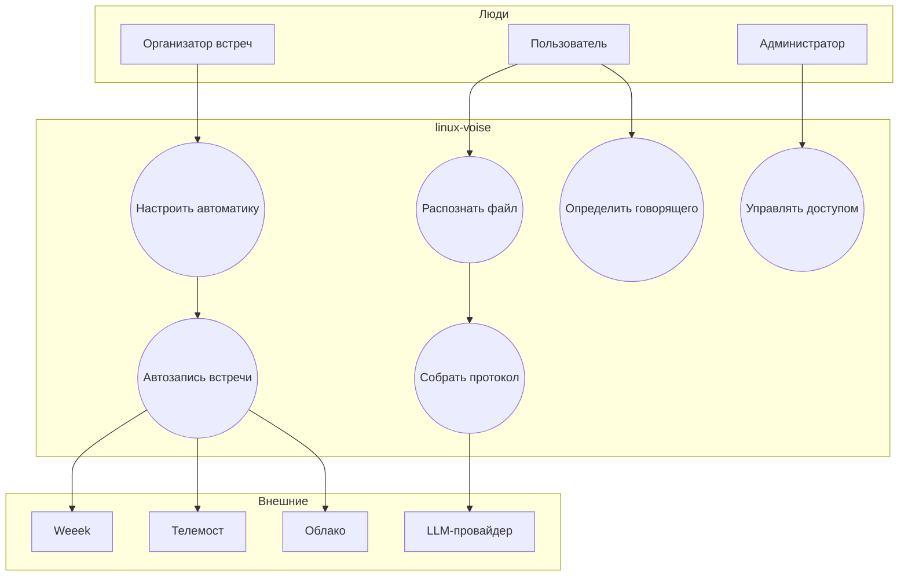
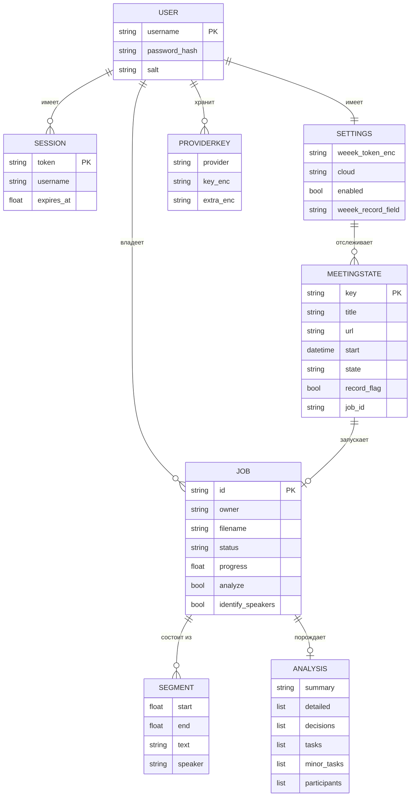
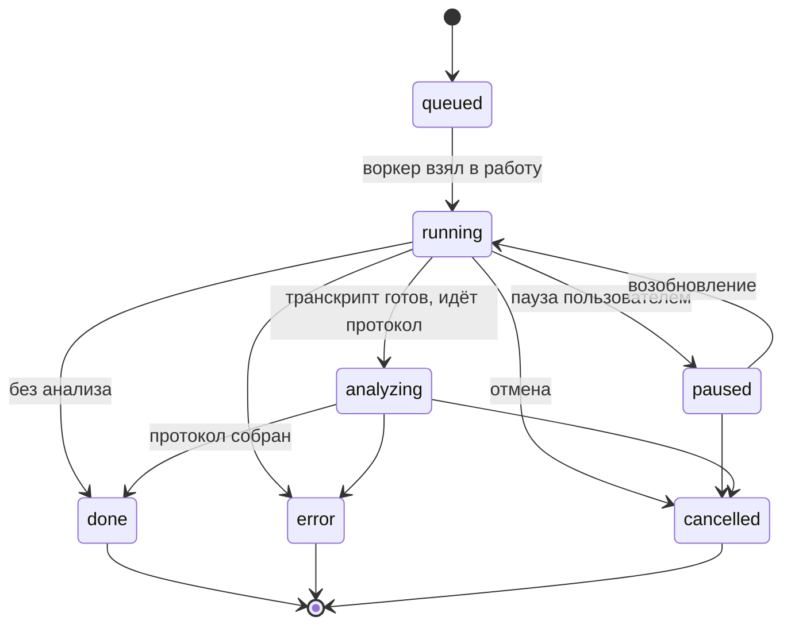
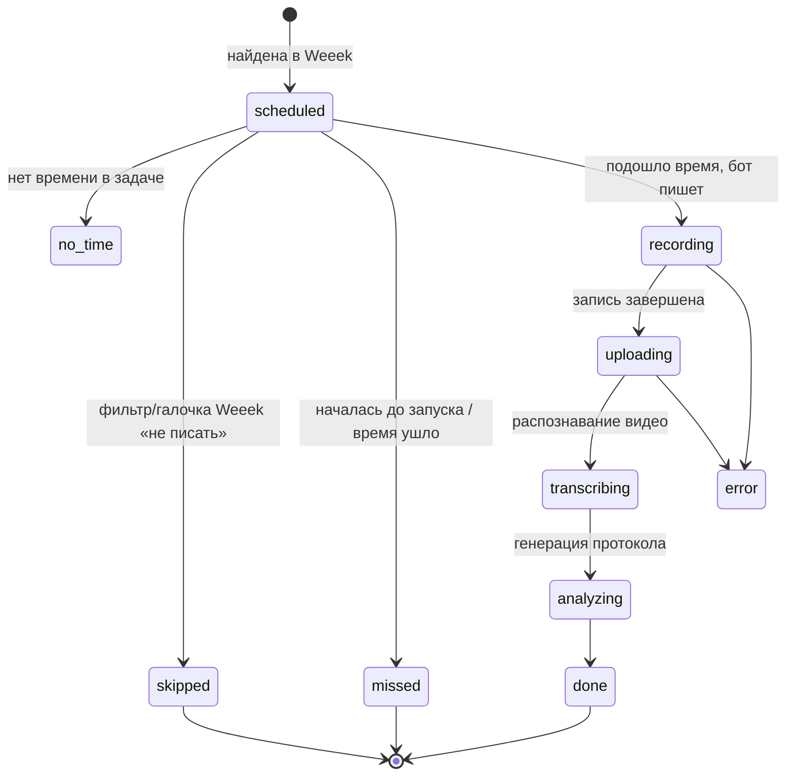

# 🧩 Системный анализ

Здесь бизнес-хотелки превращаются в **точные требования к системе**: кто ею
пользуется (акторы), что она обязана делать (функциональные требования), какой она
должна быть (нефункциональные), какими данными оперирует (сущности) и в каких
состояниях бывают ключевые объекты.

Связанные документы: **[Бизнес-анализ](БИЗНЕС-АНАЛИЗ.md)**, **[Функционал](ФУНКЦИОНАЛ.md)**,
**[Диаграммы](ДИАГРАММЫ-UML-BPMN.md)**, **[Архитектура](АРХИТЕКТУРА.md)**.

---

## 1. Акторы (кто взаимодействует с системой)

| Актор | Тип | Роль |
|---|---|---|
| **Пользователь** | человек | Загружает файлы, получает текст и протокол, настраивает автоматику. |
| **Организатор встреч** | человек | Заводит встречи в Weeek, решает, какие писать. |
| **Администратор** | человек | Разворачивает сервис, первый вход = админ, задаёт `VTX_*`. |
| **Планировщик** | внутренний | Фоновый демон: сам опрашивает Weeek и запускает запись. |
| **Бот-рекордер** | внутренний | Заходит в Телемост браузером и пишет A/V. |
| **Weeek** | внешняя система | Источник встреч (ссылка + время) и приёмник ссылок/комментариев. |
| **Телемост** | внешняя система | Площадка встречи, куда заходит бот. |
| **Облако** | внешняя система | Яндекс.Диск / Google Drive / локальный диск для файлов. |
| **LLM-провайдер** | внешняя/локальная | Ollama (локально) или Groq/Gemini/YandexGPT/GigaChat/Claude — пишет протокол. |

*(Это диаграмма вариантов использования — «кто что делает». Подробные UML-схемы — в
[отдельном документе](ДИАГРАММЫ-UML-BPMN.md).)*

---

## 2. Функциональные требования (что система обязана уметь)

### 2.1. Распознавание и протокол (ядро)

| № | Требование |
|---|---|
| FR-1 | Принимать аудио/видео файлы и распознавать речь в текст (TXT/SRT/JSON) с тайм-кодами. |
| FR-2 | Показывать прогресс распознавания и текст **в реальном времени** (стрим). |
| FR-3 | Позволять паузу/возобновление/отмену задачи. |
| FR-4 | Выбирать модель распознавания (баланс «скорость/точность»). |
| FR-5 | Применять подсказку имён/терминов и глоссарий замен «как слышится → правильно». |
| FR-6 | Собирать структурированный протокол ИИ: краткое содержание, темы, решения, задачи (крупные и мелкие), ответственные, участники. |
| FR-7 | Экспортировать протокол в **Word (.docx)** и давать скачать TXT/SRT/JSON. |
| FR-8 | Поддерживать несколько LLM-провайдеров с выбором тарифа модели. |
| FR-9 | Хранить несколько API-ключей на провайдера и **авто-ротировать** их при исчерпании лимита. |
| FR-10 | Позволять «экспертный» режим — полностью редактируемый промпт. |
| FR-11 | Пере-собирать протокол по готовому тексту другим движком (reanalyze). |

### 2.2. Определение говорящего и содержимого

| № | Требование |
|---|---|
| FR-12 | Определять, **кто говорил**, по видео Телемоста (зелёная подсветка + имя из кадра) и подписывать сегменты. |
| FR-13 | Опционально — диаризация по звуку (pyannote), если включена. |
| FR-14 | Распознавать текст, показанный на экране (OCR слайдов/кода) и учитывать его в протоколе. |

### 2.3. Автоматизация встреч

| № | Требование |
|---|---|
| FR-15 | Периодически опрашивать Weeek и находить встречи (ссылка на Телемост + время). |
| FR-16 | В назначенное время заходить ботом в Телемост (гость, микрофон/камера выкл.) и записывать экран+звук. |
| FR-17 | Останавливать запись: вручную, когда все вышли, по порогу тишины/участников, по потолку длительности. |
| FR-18 | Выгружать запись в выбранное облако; протоколы — в **отдельную** папку. |
| FR-19 | Записывать ссылки на запись/протокол в кастом-поля задачи Weeek и/или комментарий. |
| FR-20 | Решать, писать ли встречу: ручной выбор > **галочка Weeek «Запись встречи»** > режим/фильтры (слова, время, дни). |
| FR-21 | Запускать запись «Сейчас» вручную и делать принудительный опрос Weeek кнопкой. |
| FR-22 | Показывать список встреч с живыми статусами (запись → распознавание видео → генерация протокола → готово) **без перезагрузки**; отдельно — встречи «на сегодня». |
| FR-23 | Писать несколько встреч параллельно (до лимита слотов), каждая изолирована. |

### 2.4. Доступ и данные

| № | Требование |
|---|---|
| FR-24 | Закрывать весь доступ логином/паролем; регистрация — по коду (кроме первого = админ). |
| FR-25 | Изолировать данные и токены каждого пользователя; шифровать секреты. |
| FR-26 | Хранить настройки/токены автоматики на диске, чтобы переживали перезапуск. |
| FR-27 | Автоматически удалять старые результаты по ретеншну. |

---

## 3. Нефункциональные требования (каким должно быть)

| Категория | Требование |
|---|---|
| **Производительность** | Работать на обычном CPU без GPU (int8, один воркер); память предсказуема (одна модель за раз). |
| **Масштаб записи** | До `VTX_MAX_CONCURRENT_RECORDINGS` встреч одновременно (по умолч. 4), каждая на своём виртуальном экране и аудио-синке. |
| **Надёжность** | Сетевые вызовы к внешним API — с ретраями/бэкофом; бот имеет ручной фолбэк и гарантированные стопы. |
| **Приватность** | Локальная обработка по умолчанию; наружу — только по явному выбору. |
| **Безопасность** | PBKDF2 для паролей, сессии-cookie (HttpOnly), Fernet-шифрование секретов, изоляция по пользователям. |
| **Портируемость** | Один Docker-образ; `python:3.12-slim-bookworm`; запуск одной командой локально и на сервере. |
| **Наблюдаемость** | Логи бота, скриншот при неудаче входа, `/healthz`, статус готовности компонентов в UI. |
| **Удобство** | Простой веб-UI на русском; живые обновления; подсказки готовности зависимостей. |
| **Совместимость** | Пины версий (`ctranslate2==4.4.0`, Python 3.12) ради стабильности распознавания. |
| **Восстанавливаемость** | Незавершённые при рестарте задачи помечаются прерванными; анализ можно повторить одной кнопкой. |

---

## 4. Сущности данных (из чего состоит «мир» системы)

Краткое описание ключевых сущностей:

| Сущность | Что это | Где живёт |
|---|---|---|
| **User** | учётная запись (логин, хэш пароля, соль) | `data/users.json` |
| **Session** | активный вход (токен-cookie, срок) | `data/sessions.json` |
| **Job** | задача распознавания/протокола: файл, статус, прогресс, опции | `data/jobs.json` + результаты в `data/results` |
| **Segment** | одна распознанная реплика: начало/конец/текст/спикер | внутри результата задачи (`*.json`) |
| **Analysis** | структурированный протокол (итоги, темы, решения, задачи, ответственные) | внутри задачи + `*.docx` |
| **Settings** | настройки автоматики и токены (зашифрованы) | `data/users/<логин>/automation.json` |
| **ProviderKey** | API-ключ(и) LLM пользователя (зашифрованы) | под ключом пользователя |
| **MeetingState** | встреча, которую отслеживает планировщик, и её статус | в памяти планировщика |

---

## 5. Состояния ключевых объектов

### 5.1. Задача распознавания (Job)

### 5.2. Встреча в планировщике (MeetingState)

> Живые статусы `transcribing`/`analyzing`/`done` подтягиваются из состояния самой
> задачи распознавания и отображаются в интерфейсе без перезагрузки страницы.

---

## 6. Ограничения и допущения

- **Нет API ботов у Телемоста** → запись через браузер, что по своей природе
  хрупко (вёрстка, вход, капча). Заложены фолбэки и логи.
- **CPU-only** → тяжёлые модели работают медленно; выбран баланс «скорость/качество».
- **Один воркер распознавания** → задачи выполняются последовательно (запись — до
  нескольких параллельно).
- **Часовые пояса** берутся из `tzdata`/`zoneinfo`; время встреч трактуется в TZ
  воркспейса.
- **Имя говорящего** зависит от того, что Телемост подписывает участников и
  подсвечивает активного (при необходимости — калибровка цвета `VTX_SPEAKER_*`).

---

## 7. Трассируемость (бизнес → система)

| Бизнес-требование | Функциональные требования |
|---|---|
| BR-1 распознавать без ручного труда | FR-1..FR-5 |
| BR-2 понятный протокол с ответственными | FR-6, FR-7, FR-12 |
| BR-3 локально и приватно | НФТ приватность/безопасность, FR-25 |
| BR-4 автозапись из Weeek | FR-15..FR-23 |
| BR-5 результаты в облако + ссылка в задачу | FR-18, FR-19 |
| BR-6 правильно «кто говорил» | FR-12, FR-13 |
| BR-7 простой UI | FR-22, НФТ удобство |
| BR-8 разворачивать одной командой 24/7 | НФТ портируемость/надёжность |
| BR-9 не терять доступы | FR-26 |
